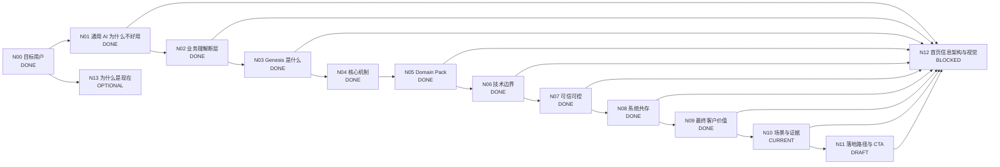

# Genesis 产品介绍 DAG

> 目标：把 Genesis 官网从“功能说明”整理为完整的客户认知闭环，并按 DAG 节点逐个定稿。

## 工作原则

- 首页优先服务：**已经想用 AI、甚至已经试过通用 AI，但发现进入真实企业业务后不好用**的业务负责人和技术负责人。
- 页面主线：**痛点 → 为什么会这样 → Genesis 补了什么 → 为什么可信 → 达成什么价值 → 怎么开始**。
- 不把 Genesis 讲成另一个大模型 / RAG / Agent / 数据平台。
- 不贬低现有技术；解释各层各自解决什么，以及 Genesis 补哪一层。
- 首页先讲客户问题和业务价值；技术概念只用于解释可信性、差异化和落地。
- 每个抽象概念必须能用真实业务 instance 解释，并至少跨多个场景验证。
- 主 DAG 只保留稳定结论和状态；复杂推导进入独立文档。

## 状态

- `DONE`：结论和表达已稳定。
- `CURRENT`：当前优先讨论。
- `DRAFT`：已有方向，待收敛。
- `TODO`：尚未正式讨论。
- `BLOCKED`：依赖前置节点。
- `OPTIONAL`：重要，但不阻塞首页主线。

## DAG



## 节点总表

| 节点 | 核心问题 | 状态 | 首页作用 |
|---|---|---|---|
| N00 目标用户 | 谁会觉得 Genesis 有价值？ | DONE | 决定全站语言 |
| N01 通用 AI 为什么不好用 | 为什么模型很聪明，一进企业就不好用？ | DONE | 建立痛点共识 |
| N02 业务理解断层 | 企业已有 AI 和数据平台，为什么还不够？ | DONE | 建立 Genesis 必要性 |
| N03 Genesis 是什么 | Genesis 补的是哪一层？ | DONE | 产品定位 |
| N04 核心机制 | 怎样把企业业务世界变成 AI 可使用的 Context 与 Capability？ | DONE | 方案解释 |
| N05 Domain Pack | 如何复用领域能力，同时表达企业自己的工作方式？ | DONE | 领域化 / 企业化 |
| N06 边界比较 | 与 Data、Semantic、KG、RAG、Fine-tuning、Agent 的关系？ | DONE | 避免错误归类 |
| N07 可信可控 | 为什么敢让 AI 真正判断和工作？ | DONE | 建立信任 |
| N08 系统共存 | 现有系统如何复用而不是替换？ | DONE | 降低实施顾虑 |
| N09 最终价值 | 客户为什么愿意为 Genesis 付费？ | DONE | 价值闭环 |
| N10 场景与证据 | 哪些示例能解释产品，哪些证据能证明产品？ | CURRENT | Proof |
| N11 落地路径 | 客户怎样低成本开始？ | DRAFT | CTA |
| N12 首页结构 | 如何形成低认知负担的首页？ | BLOCKED | 最终页面 |
| N13 为什么是现在 | 为什么企业化成为新的 AI 瓶颈？ | OPTIONAL | 市场背景 |

---

# N00–N03 DONE：需求与定位

目标用户：已经尝试通用 AI、希望进入真实业务的业务负责人，以及已有 Data / RAG / Agent 基础但发现业务理解被重复建设的技术负责人。

核心痛点：

> **通用 AI 很聪明，但一到你的公司就不好用了。**

原因：**企业事实 → 业务理解 → 企业工作方式**缺失。

> **有 AI + 有企业数据，不自动等于企业 AI。**

Genesis 定义：

> **Genesis 是连接企业业务世界与通用 AI 的企业业务理解平台。**

> **大模型已经懂世界。Genesis 让它懂你的公司。**

---

# N04 DONE：核心机制

1. **长期业务底座**；
2. **动态 Task Context**；
3. **可复用 Business Capability**。

> **Context 解决“这一次 AI 需要知道什么”；Capability 解决“这家公司如何稳定、重复地完成这类工作”。**

详细：`docs/product-concept-scenario-instances.md`

---

# N05 DONE：Domain Pack

> **Domain Pack = Domain Blueprint + Enterprise Overlay。**

> **专业是共性的，工作方式是你的。**

详细：`docs/domain-pack-scenario-mapping.md`

---

# N06 DONE：技术边界

Genesis 将散落在 Prompt、RAG、Agent、Workflow 和应用代码中的 Business Glue 提升成企业共享资产：

> **Application-local Business Glue → Shared Enterprise Business Understanding**

核心复用对象：

> **Business Context / Business Capability**

> **Genesis 不替企业重建 AI 技术栈，而是让现有 Data、AI、Agent 共享同一个企业业务世界。**

详细：`docs/n06-platform-boundary-and-comparison.md`

---

# N07 DONE：可信、可控、安全

分成：

- **Business Trust Plane**：Source / Fact、Context、Judgment、Evidence、Action、Audit / Recovery；
- **Platform Security Baseline**：IAM、Isolation、Encryption、Secrets、Network、Data Residency、Runtime Security 等。

核心：

> **有依据 / 有边界 / 知道什么时候不知道 / 可追溯**

> **该自动的自动，该确认的确认，该停止的停止。**

详细：`docs/n07-trust-control-framework.md`

---

# N08 DONE：系统共存

> **Reuse, don't replace.**

Genesis 不是所有数据 / 请求必须经过的中央中间件，而是共享的：

> **Business Context & Capability Plane / Federated Business Understanding**

Source of Truth 保留在现有系统；已有 Data / Semantic / KG / RAG / AI / Agent 能复用就复用；按场景选择实时联邦查询或局部 Cache / Index / Materialization；Write-back 优先走现有业务系统正式 API / Workflow。

官网表达：

> **不用替换现有系统。数据、模型、Agent 继续用；Genesis 补上共享的业务理解与能力。**

详细：`docs/n08-system-coexistence-and-integration.md`

---

# N09 DONE：最终客户价值

价值阶梯：

```text
Useful
  ↓
Reliable
  ↓
Actionable
  ↓
Reusable
  ↓
Compounding
```

即：

> **从业务可用 → 判断可信 → 任务可交付 → 能力可复用 → 企业专业工作方式持续沉淀。**

最强价值主张候选：

> **不是让 AI 回答更多，而是让更多工作真正可以交给 AI。**

首页只保留三项：

1. **判断更可靠** — 基于当前事实、规则与 Evidence；
2. **真正能做事** — 从回答进入判断、协作与受控执行；
3. **能力持续复用** — 同一业务理解与 Capability 被更多模型、Agent、App 使用。

不同购买理由：

- 业务负责人：结果能不能用、能不能少做重复工作、能不能稳定交给 AI；
- 技术负责人：Business Glue 能否一次沉淀、多处复用，新场景是否越来越快；
- CIO / CTO：保护已有技术投资、降低 AI 项目碎片化、把企业专业能力沉淀成长期资产。

不编未经验证的 ROI 数字；N10 再用真实场景测 Decision Lead Time、Task Completion、Human Touches、Rework、Capability Reuse、Time-to-Value 等指标。

详细：`docs/n09-customer-value-framework.md`

---

# N10 CURRENT：场景与证据

当前必须区分两件事：

1. **Scenario / Instance**：帮助用户理解 Genesis 是怎么工作的；
2. **Proof / Evidence**：证明 Genesis 在真实客户 / POC / 生产环境中确实带来了价值。

不能把设计出来的示例场景包装成真实客户案例，也不能只有场景没有证据。

N10 下一步要建立：

- 场景模板；
- Proof 成熟度分级；
- 可公开 / 匿名 / 内部案例边界；
- 业务指标 / 平台指标；
- 首页应该展示什么层级的证据。

---

# N11 DRAFT：落地路径与 CTA

从一个真实、高价值业务问题开始，跑通闭环，再沉淀并复用能力。

# N12 BLOCKED：首页信息架构与视觉

关键主节点定稿后统一重构，不按内部模块顺序堆页面。

# N13 OPTIONAL：为什么是现在

模型能力已足够强，企业 AI 的瓶颈逐步从“模型够不够强”转为“有没有企业业务上下文、治理和可复用业务能力”。

---

## 更新记录

- 2026-09-03：N00–N08 定稿。
- 2026-09-03：N09 定稿为 Useful → Reliable → Actionable → Reusable → Compounding 价值阶梯。
- 2026-09-03：进入 N10，开始严格区分场景示例与真实 Proof。
