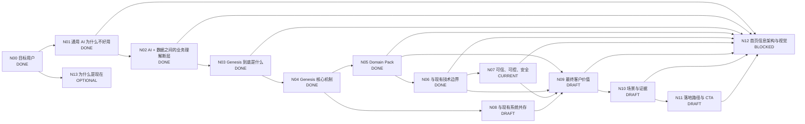

# Genesis 产品介绍 DAG

> 目标：把 Genesis 官网从“功能说明”整理为完整的客户认知闭环，并按 DAG 节点逐个定稿。

## 工作原则

- 首页优先服务：**已经想用 AI、甚至已经试过通用 AI，但发现进入真实企业业务后不好用**的业务负责人和技术负责人。
- 页面主线：**痛点 → 为什么会这样 → Genesis 补了什么 → 为什么可信 → 达成什么价值 → 怎么开始**。
- 不把 Genesis 讲成另一个大模型 / RAG / Agent / 数据平台。
- 不贬低现有技术；解释各层各自解决什么，以及 Genesis 补哪一层。
- 首页先讲客户问题和业务价值；技术概念只用于解释可信性、差异化和落地。
- 每个抽象概念必须能用真实业务 instance 解释，并至少跨多个场景验证。
- 主 DAG 只保留稳定结论和状态；复杂推导进入独立文档。

## 状态

- `DONE`：结论和表达已稳定。
- `CURRENT`：当前优先讨论。
- `DRAFT`：已有方向，待收敛。
- `TODO`：尚未正式讨论。
- `BLOCKED`：依赖前置节点。
- `OPTIONAL`：重要，但不阻塞首页主线。

## DAG



## 节点总表

| 节点 | 核心问题 | 状态 | 首页作用 |
|---|---|---|---|
| N00 目标用户 | 谁会觉得 Genesis 有价值？ | DONE | 决定全站语言 |
| N01 通用 AI 为什么不好用 | 为什么模型很聪明，一进企业就不好用？ | DONE | 建立痛点共识 |
| N02 业务理解断层 | 企业已有 AI 和数据平台，为什么还不够？ | DONE | 建立 Genesis 必要性 |
| N03 Genesis 是什么 | Genesis 补的是哪一层？ | DONE | 产品定位 |
| N04 核心机制 | 怎样把企业业务世界变成 AI 可使用的 Context 与 Capability？ | DONE | 方案解释 |
| N05 Domain Pack | 如何复用领域能力，同时表达企业自己的工作方式？ | DONE | 领域化 / 企业化 |
| N06 边界比较 | 与 Data Platform、Semantic Layer、KG、RAG、Fine-tuning、Agent 的关系？ | DONE | 避免错误归类 |
| N07 可信可控 | 为什么敢让 AI 真正判断和工作？ | CURRENT | 建立信任 |
| N08 系统共存 | 现有 ERP、CRM、数据平台、Agent 是否替换？ | DRAFT | 降低实施顾虑 |
| N09 最终价值 | 企业专属 AI 最终带来什么？ | DRAFT | 价值闭环 |
| N10 场景与证据 | 如何证明价值？ | DRAFT | Proof |
| N11 落地路径 | 客户怎样低成本开始？ | DRAFT | CTA |
| N12 首页结构 | 如何形成低认知负担的首页？ | BLOCKED | 最终页面 |
| N13 为什么是现在 | 为什么企业化成为新的 AI 瓶颈？ | OPTIONAL | 市场背景 |

---

# N00 DONE：目标用户

第一目标用户：已经尝试通用 AI、希望进入真实业务的业务负责人 / 管理者。

第二目标用户：已有 Data / RAG / Agent 等基础、但发现业务理解被每个应用重复建设的技术 / AI 团队负责人。

共同触发场景：

> **我们想用 AI，也已经试过，但它一进入真正的企业业务就不好用了。**

---

# N01 DONE：为什么通用 AI 一进企业就不好用

根因不是模型不聪明，而是缺少企业私有的：

- **企业事实**：现在真正发生了什么；
- **业务语义与上下文**：这些信息在公司里意味着什么；
- **企业工作方式**：公司应该怎么判断、怎么做、什么不能做。

压缩为：

> **事实 → 理解 → 行动**

核心表达：

> **通用 AI 很聪明，但一到你的公司就不好用了。**

---

# N02 DONE：AI + Data 之间的业务理解断层

> **有 AI + 有企业数据，不自动等于企业 AI。**

因为：

> **数据不会自动变成业务含义，业务含义也不会自动变成企业判断和工作方式。**

对业务用户统一称：**业务理解层**。

技术下钻：

> **Business Semantics + Facts + Context + Rules / Methods / Boundaries**

稳定表达：

> **AI 缺的不是更多数据，而是知道这些数据在你的公司意味着什么。**

> **数据平台让数据可用；Genesis 让 AI 理解数据背后的业务世界。**

---

# N03 DONE：Genesis 到底是什么

业务语言：

> **Genesis 让通用 AI 真正理解你的公司。**

品牌表达：

> **大模型已经懂世界。Genesis 让它懂你的公司。**

产品定义：

> **Genesis 是连接企业业务世界与通用 AI 的企业业务理解平台。**

技术解释：形成统一、持续、可治理、可复用的 **AI-ready Business Context**。

---

# N04 DONE：Genesis 核心机制

## 三部分结构

1. **长期业务底座**：Business Model / Ontology、Source Binding、Rules / Methods / Boundaries、Capability Definitions。
2. **动态 Task Context**：按当前用户、任务和业务对象动态组合 Facts、Evidence、关系、历史、规则与权限。
3. **Business Capability**：把企业如何完成某类业务判断 / 工作沉淀成可复用能力契约。

关键边界：

> **Context 解决“这一次 AI 需要知道什么”；Capability 解决“这家公司如何稳定、重复地完成这类工作”。**

Evidence、Permission、Boundary 是横向约束。

完整场景：`docs/product-concept-scenario-instances.md`

---

# N05 DONE：Domain Pack

最终定义：

> **Domain Pack 是把一个专业领域的可复用业务模型与能力，按照某家企业自己的数据、规则、方法和边界完成企业化配置。**

结构：

```text
Domain Blueprint
      +
Enterprise Overlay
      ↓
Company-specific Domain Pack
      +
Current Facts / Task Context
      ↓
Enterprise-specific AI Capability
```

传播表达：

> **专业是共性的，工作方式是你的。**

完整映射：`docs/domain-pack-scenario-mapping.md`

---

# N06 DONE：与现有技术的边界

## 最终结论

Genesis 不和 Data Platform、Semantic Layer、KG、RAG、Fine-tuning、LLM、Agent 做“谁更高级”的比较，而是解决它们在企业 AI 项目中经常共同缺失的一件事：

> **统一、持续、可治理、可跨应用复用的企业业务理解与业务能力。**

传统 AI 项目常把 Business Glue 分散在 Prompt、RAG、Agent、Workflow 和应用代码中，每做一个新应用都重新解释对象、字段、规则、权限和判断方法。

Genesis 的架构价值是：

> **把 Application-local Business Glue 提升成 Shared Enterprise Business Understanding。**

不同技术的主要复用对象：

| 技术 | 典型核心复用对象 |
|---|---|
| Data Platform | Dataset / Table / Metric |
| Semantic Layer | Metric / Dimension / Business Term |
| Knowledge Graph | Entity / Relationship |
| RAG | Document / Chunk / Retrieved Context |
| Fine-tuning | Model behavior / learned pattern |
| Agent / Workflow | Tool / Task / Workflow |
| **Genesis** | **Business Context / Business Capability** |

关系原则：

- 已有 Data Platform / Semantic Layer / KG 应优先复用，不重复建设；
- RAG / SQL / Graph Query / API 都可以成为 Genesis 获取 Facts / Context 的机制；
- Fine-tuning 可改善模型行为，但不承担动态 Facts、实时规则、权限和 Evidence 治理；
- Agent 负责“怎么执行”，Genesis 负责“这件事在企业业务里意味着什么、依据什么、允许做什么”。

稳定表达：

> **Genesis 不替企业重建 AI 技术栈，而是让现有 Data、AI、Agent 共享同一个企业业务世界。**

> **过去每做一个 AI 应用，都要重新教一遍公司；Genesis 让业务理解持续维护、多处复用。**

详细推导：`docs/n06-platform-boundary-and-comparison.md`

---

# N07 CURRENT：可信、可控、安全

当前核心问题：

> **AI 即使已经懂公司，为什么企业敢让它真的判断、建议甚至执行？**

当前方向不是承诺“AI 永不出错”，而是建立完整 Trust Chain：

```text
Trusted Source
     ↓
Verifiable Fact
     ↓
Authorized Task Context
     ↓
Governed Judgment
     ↓
Controlled Action
     ↓
Auditable Result
```

对应六个控制面：

1. **Fact Integrity**：来源、时间、版本、冲突、时效；
2. **Context Governance**：用户、任务、对象、数据权限在 Context 构建时即生效；
3. **Governed Judgment**：Hard Rules 与 Model Judgment 分离；
4. **Evidence & Uncertainty**：知道依据什么、缺什么、何时不能判断；
5. **Controlled Action**：判断与执行分权，高风险动作人工确认；
6. **Audit & Recovery**：形成完整 Business Decision Trace，可复盘、可回滚 / 接管。

核心产品原则：

> **有依据才判断；依据不足，就明确说不知道。**

> **该自动的自动，该确认的确认，该停止的停止。**

首页候选压缩：

> **有依据 / 有边界 / 知道什么时候不知道 / 可追溯**

详细框架：`docs/n07-trust-control-framework.md`

N07 下一步需要继续确认：

- “可信”和“安全”哪些属于 Genesis Business Governance，哪些属于 LLM / Runtime Security；
- Evidence Sufficiency、Source Conflict、Data Freshness 如何作为通用机制；
- Capability 的 Action Risk Tier 与 Human-in-the-loop 如何标准化；
- 首页是否需要把 Trust 作为独立区块，还是嵌入主叙事。

---

# N08 DRAFT：与现有系统共存

原则：保留现有 ERP、CRM、数据库、Data Platform、模型、Agent 和 App，Genesis 增加业务理解与能力层；优先复用而非迁移重建。

# N09 DRAFT：最终客户价值

候选：判断更可靠、工作更专业、真正进入业务、业务能力可复用、减少重复建设和失控风险。

# N10 DRAFT：场景与证据

每个场景必须有：**原来怎么做 → Genesis 如何介入 → 结果变化 → Evidence / 指标**。

# N11 DRAFT：落地路径与 CTA

从一个真实、高价值业务问题开始，跑通闭环，再沉淀并复用能力。

# N12 BLOCKED：首页信息架构与视觉

关键主节点定稿后统一重构，不按内部模块顺序堆页面。

# N13 OPTIONAL：为什么是现在

模型能力已足够强，企业 AI 的瓶颈逐步从“模型够不够强”转为“有没有企业业务上下文、治理和可复用业务能力”。

---

## 更新记录

- 2026-09-03：N00–N05 定稿。
- 2026-09-03：N06 定稿。核心为 Shared Enterprise Business Understanding；现有 Data / AI / Agent 优先复用。
- 2026-09-03：进入 N07，建立 Trust Chain 与六个控制面。
