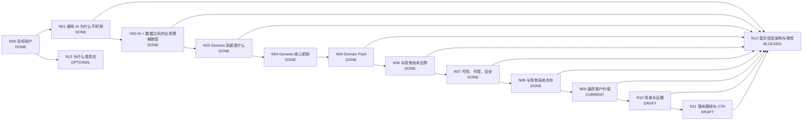

# Genesis 产品介绍 DAG

> 目标：把 Genesis 官网从“功能说明”整理为完整的客户认知闭环，并按 DAG 节点逐个定稿。

## 工作原则

- 首页优先服务：**已经想用 AI、甚至已经试过通用 AI，但发现进入真实企业业务后不好用**的业务负责人和技术负责人。
- 页面主线：**痛点 → 为什么会这样 → Genesis 补了什么 → 为什么可信 → 达成什么价值 → 怎么开始**。
- 不把 Genesis 讲成另一个大模型 / RAG / Agent / 数据平台。
- 不贬低现有技术；解释各层各自解决什么，以及 Genesis 补哪一层。
- 首页先讲客户问题和业务价值；技术概念只用于解释可信性、差异化和落地。
- 每个抽象概念必须能用真实业务 instance 解释，并至少跨多个场景验证。
- 主 DAG 只保留稳定结论和状态；复杂推导进入独立文档。

## 状态

- `DONE`：结论和表达已稳定。
- `CURRENT`：当前优先讨论。
- `DRAFT`：已有方向，待收敛。
- `TODO`：尚未正式讨论。
- `BLOCKED`：依赖前置节点。
- `OPTIONAL`：重要，但不阻塞首页主线。

## DAG



## 节点总表

| 节点 | 核心问题 | 状态 | 首页作用 |
|---|---|---|---|
| N00 目标用户 | 谁会觉得 Genesis 有价值？ | DONE | 决定全站语言 |
| N01 通用 AI 为什么不好用 | 为什么模型很聪明，一进企业就不好用？ | DONE | 建立痛点共识 |
| N02 业务理解断层 | 企业已有 AI 和数据平台，为什么还不够？ | DONE | 建立 Genesis 必要性 |
| N03 Genesis 是什么 | Genesis 补的是哪一层？ | DONE | 产品定位 |
| N04 核心机制 | 怎样把企业业务世界变成 AI 可使用的 Context 与 Capability？ | DONE | 方案解释 |
| N05 Domain Pack | 如何复用领域能力，同时表达企业自己的工作方式？ | DONE | 领域化 / 企业化 |
| N06 边界比较 | 与 Data Platform、Semantic Layer、KG、RAG、Fine-tuning、Agent 的关系？ | DONE | 避免错误归类 |
| N07 可信可控 | 为什么敢让 AI 真正判断和工作？ | DONE | 建立信任 |
| N08 系统共存 | 现有 ERP、CRM、Data、KG、RAG、AI、Agent 如何复用？ | DONE | 降低实施顾虑 |
| N09 最终价值 | 企业专属 AI 最终带来什么？ | CURRENT | 价值闭环 |
| N10 场景与证据 | 如何证明价值？ | DRAFT | Proof |
| N11 落地路径 | 客户怎样低成本开始？ | DRAFT | CTA |
| N12 首页结构 | 如何形成低认知负担的首页？ | BLOCKED | 最终页面 |
| N13 为什么是现在 | 为什么企业化成为新的 AI 瓶颈？ | OPTIONAL | 市场背景 |

---

# N00–N03 DONE：需求与定位

目标用户：已经尝试通用 AI、希望进入真实业务的业务负责人，以及已有 Data / RAG / Agent 基础但发现业务理解被重复建设的技术负责人。

核心痛点：

> **通用 AI 很聪明，但一到你的公司就不好用了。**

原因压缩为：

> **事实 → 理解 → 行动**

业务理解断层：

> **有 AI + 有企业数据，不自动等于企业 AI。**

> **AI 缺的不是更多数据，而是知道这些数据在你的公司意味着什么。**

Genesis 产品定义：

> **Genesis 是连接企业业务世界与通用 AI 的企业业务理解平台。**

品牌表达：

> **大模型已经懂世界。Genesis 让它懂你的公司。**

---

# N04 DONE：核心机制

1. **长期业务底座**：Business Model / Ontology、Source Binding、Rules / Methods / Boundaries、Capability Definitions；
2. **动态 Task Context**：按用户、任务和对象动态组合 Facts、Evidence、关系、历史、规则和权限；
3. **Business Capability**：把企业如何稳定完成某类判断 / 工作沉淀成可复用能力契约。

> **Context 解决“这一次 AI 需要知道什么”；Capability 解决“这家公司如何稳定、重复地完成这类工作”。**

完整场景：`docs/product-concept-scenario-instances.md`

---

# N05 DONE：Domain Pack

> **Domain Pack = Domain Blueprint + Enterprise Overlay。**

领域复用专业结构和能力框架；企业配置自己的数据、指标口径、规则、方法、流程、权限和 Capability；当前 Facts / Context 运行时绑定。

> **专业是共性的，工作方式是你的。**

详细：`docs/domain-pack-scenario-mapping.md`

---

# N06 DONE：与现有技术边界

Genesis 把散落在 Prompt、RAG、Agent、Workflow 和应用代码里的 Business Glue 提升成企业共享资产：

> **Application-local Business Glue → Shared Enterprise Business Understanding**

Genesis 的核心复用对象是：

> **Business Context / Business Capability**

已有 Data / Semantic / KG / RAG / AI / Agent 能复用就不重建。

> **Genesis 不替企业重建 AI 技术栈，而是让现有 Data、AI、Agent 共享同一个企业业务世界。**

详细：`docs/n06-platform-boundary-and-comparison.md`

---

# N07 DONE：可信、可控、安全

最终分成：

- **Business Trust Plane**：Source / Fact、Context、Judgment、Evidence、Action、Audit / Recovery；
- **Platform Security Baseline**：IAM、Isolation、Encryption、Secrets、Network、Data Residency、Runtime Security 等。

Trust Chain：

```text
Governed Source
      ↓
Traceable Fact
      ↓
Authorized Context
      ↓
Governed Judgment
      ↓
Controlled Action
      ↓
Auditable Result
```

核心表达：

> **有依据 / 有边界 / 知道什么时候不知道 / 可追溯**

> **该自动的自动，该确认的确认，该停止的停止。**

详细：`docs/n07-trust-control-framework.md`

---

# N08 DONE：与现有系统共存

核心原则：

> **Reuse, don't replace.**

Genesis 不要求所有数据 / 请求经过自己的中央管道，而更接近：

> **Shared Business Context & Capability Plane / Federated Business Understanding**

现有系统继续负责：

- ERP / CRM / MES / CMDB：System of Record / 事务；
- Data Platform：集成、治理、指标、数据服务；
- Semantic / MDM / KG：语义、主数据、关系；
- RAG：Context / Evidence Provider；
- AI Platform：模型；
- Agent / Workflow：执行；
- App：用户入口。

Genesis 主要管理：

> **Business Model / Mapping / Domain Pack / Rules / Context / Evidence Requirements / Capability / Permission / Decision Trace**

Source of Truth 不必迁入 Genesis；运行时可以联邦查询，也可以按性能需求局部 Cache / Index / Materialize。

业务 Write-back 优先通过现有系统正式 API / Workflow，继续复用其事务、权限和审计。

接入方式可以是 Capability API、Context Provider、Orchestrated Capability、Event-driven Capability。

官网表达：

> **不用替换现有系统。数据、模型、Agent 继续用；Genesis 补上共享的业务理解与能力。**

> **从一个业务问题开始，形成的能力再复用到更多场景。**

详细：`docs/n08-system-coexistence-and-integration.md`

---

# N09 CURRENT：最终客户价值

当前要解决：Genesis 的价值不能只停留在“AI 更懂业务”。需要区分并排序：

1. **直接业务价值**：判断更可靠、响应更快、工作更专业、更多真实任务可交给 AI；
2. **组织能力价值**：专家经验与企业工作方式可以沉淀、治理、持续演进；
3. **平台复用价值**：业务理解和 Capability 一次建设、多模型 / 多 Agent / 多 App 使用；
4. **风险治理价值**：有 Evidence、有边界、可审计、关键动作可人工控制；
5. **长期战略价值**：企业从“购买 AI 工具”走向拥有自己的可复用 AI Business Capabilities。

N09 下一步要把这些价值从抽象词转成业务负责人 / 技术负责人各自真正愿意付费的结果，并避免没有证据支撑的 ROI 数字。

---

# N10 DRAFT：场景与证据

每个场景必须有：**原来怎么做 → Genesis 如何介入 → 结果变化 → Evidence / 指标**。

# N11 DRAFT：落地路径与 CTA

从一个真实、高价值业务问题开始，跑通闭环，再沉淀并复用能力。

# N12 BLOCKED：首页信息架构与视觉

关键主节点定稿后统一重构，不按内部模块顺序堆页面。

# N13 OPTIONAL：为什么是现在

模型能力已足够强，企业 AI 的瓶颈逐步从“模型够不够强”转为“有没有企业业务上下文、治理和可复用业务能力”。

---

## 更新记录

- 2026-09-03：N00–N07 定稿。
- 2026-09-03：N08 定稿。核心为 Reuse, don't replace + Federated Business Understanding，不形成新的中央 chokepoint。
- 2026-09-03：进入 N09，开始把产品能力翻译成客户真正购买的业务价值。
