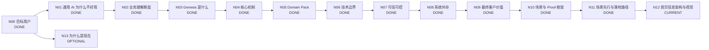

# Genesis 产品介绍 DAG

> 目标：把 Genesis 官网从“功能说明”整理为完整的客户认知闭环，并按 DAG 节点逐个定稿。

## 工作原则

- 首页优先服务：**已经想用 AI、甚至已经试过通用 AI，但发现进入真实企业业务后不好用**的业务负责人和技术负责人。
- 页面主线：**痛点 → 为什么会这样 → Genesis 补了什么 → 为什么可信 → 达成什么价值 → 怎么开始**。
- 不把 Genesis 讲成另一个大模型 / RAG / Agent / 数据平台。
- 不贬低现有技术；解释各层各自解决什么，以及 Genesis 补哪一层。
- 首页先讲客户问题和业务价值；技术概念只用于解释可信性、差异化和落地。
- 每个抽象概念必须能用真实业务 instance 解释，并至少跨多个场景验证。
- 主 DAG 只保留稳定结论和状态；复杂推导进入独立文档。
- Scenario 与 Proof 分开管理；Proof 持续升级，不阻塞产品叙事继续推进。
- **场景是客户进入 Genesis 的入口，但不是产品边界；场景产生价值，平台让场景沉淀的业务能力持续复用。**

## 状态

- `DONE`：结论和表达已稳定。
- `CURRENT`：当前优先讨论。
- `DRAFT`：已有方向，待收敛。
- `BLOCKED`：依赖前置节点。
- `OPTIONAL`：重要，但不阻塞首页主线。

## DAG



## 节点总表

| 节点 | 核心问题 | 状态 | 首页作用 |
|---|---|---|---|
| N00 目标用户 | 谁会觉得 Genesis 有价值？ | DONE | 决定全站语言 |
| N01 通用 AI 为什么不好用 | 为什么模型很聪明，一进企业就不好用？ | DONE | 建立痛点共识 |
| N02 业务理解断层 | 企业已有 AI 和数据平台，为什么还不够？ | DONE | 建立 Genesis 必要性 |
| N03 Genesis 是什么 | Genesis 补的是哪一层？ | DONE | 产品定位 |
| N04 核心机制 | 怎样把企业业务世界变成 AI 可使用的 Context 与 Capability？ | DONE | 方案解释 |
| N05 Domain Pack | 如何复用领域能力，同时表达企业自己的工作方式？ | DONE | 领域化 / 企业化 |
| N06 边界比较 | 与 Data、Semantic、KG、RAG、Fine-tuning、Agent 的关系？ | DONE | 避免错误归类 |
| N07 可信可控 | 为什么敢让 AI 真正判断和工作？ | DONE | 建立信任 |
| N08 系统共存 | 现有系统如何复用而不是替换？ | DONE | 降低实施顾虑 |
| N09 最终价值 | 客户为什么愿意为 Genesis 付费？ | DONE | 价值闭环 |
| N10 场景与 Proof | 如何用场景解释产品、用证据证明产品？ | DONE | Proof 方法论 |
| N11 场景先行与落地 | 如何从真实场景进入，同时把场景沉淀为可复用平台能力？ | DONE | Early Results / CTA / 落地 |
| N12 首页结构 | 如何形成低认知负担、场景有证据、平台逻辑清楚的首页？ | CURRENT | 最终页面 |
| N13 为什么是现在 | 为什么企业化成为新的 AI 瓶颈？ | OPTIONAL | 市场背景 |

---

# N00–N03 DONE：需求与定位

目标用户：已经尝试通用 AI、希望进入真实业务的业务负责人，以及已有 Data / RAG / Agent 基础但发现业务理解被重复建设的技术负责人。

核心痛点：

> **通用 AI 很聪明，但一到你的公司就不好用了。**

原因：**企业事实 → 业务理解 → 企业工作方式**缺失。

> **有 AI + 有企业数据，不自动等于企业 AI。**

Genesis 定义：

> **Genesis 是连接企业业务世界与通用 AI 的企业业务理解平台。**

> **大模型已经懂世界。Genesis 让它懂你的公司。**

---

# N04 DONE：核心机制

Genesis 的机制不是单向 ETL，而是：

1. **长期业务底座**；
2. **动态 Task Context**；
3. **可复用 Business Capability**。

> **Context 解决“这一次 AI 需要知道什么”；Capability 解决“这家公司如何稳定、重复地完成这类工作”。**

详细：`docs/product-concept-scenario-instances.md`

---

# N05 DONE：Domain Pack

> **Domain Pack = Domain Blueprint + Enterprise Overlay。**

> **专业是共性的，工作方式是你的。**

当前实时 Facts / Task Context 不固化在 Domain Pack 中，而由运行时绑定。

详细：`docs/domain-pack-scenario-mapping.md`

---

# N06 DONE：技术边界

Genesis 将散落在 Prompt、RAG、Agent、Workflow 和应用代码中的 Business Glue 提升成企业共享资产：

> **Application-local Business Glue → Shared Enterprise Business Understanding**

核心复用对象：

> **Business Context / Business Capability**

> **Genesis 不替企业重建 AI 技术栈，而是让现有 Data、AI、Agent 共享同一个企业业务世界。**

详细：`docs/n06-platform-boundary-and-comparison.md`

---

# N07 DONE：可信、可控、安全

分成：

- **Business Trust Plane**：Source / Fact、Context、Judgment、Evidence、Action、Audit / Recovery；
- **Platform Security Baseline**：IAM、Isolation、Encryption、Secrets、Network、Data Residency、Runtime Security 等。

核心：

> **有依据 / 有边界 / 知道什么时候不知道 / 可追溯**

> **该自动的自动，该确认的确认，该停止的停止。**

详细：`docs/n07-trust-control-framework.md`

---

# N08 DONE：系统共存

> **Reuse, don't replace.**

Genesis 不是所有数据 / 请求必须经过的中央中间件，而是共享的：

> **Business Context & Capability Plane / Federated Business Understanding**

Source of Truth 保留在现有系统；已有 Data / Semantic / KG / RAG / AI / Agent 能复用就复用；按场景选择实时联邦查询或局部 Cache / Index / Materialization；Write-back 优先走现有业务系统正式 API / Workflow。

官网表达：

> **不用替换现有系统。数据、模型、Agent 继续用；Genesis 补上共享的业务理解与能力。**

详细：`docs/n08-system-coexistence-and-integration.md`

---

# N09 DONE：最终客户价值

价值阶梯：

> **Useful → Reliable → Actionable → Reusable → Compounding**

即：

> **从业务可用 → 判断可信 → 任务可交付 → 能力可复用 → 企业专业工作方式持续沉淀。**

最强价值主张候选：

> **不是让 AI 回答更多，而是让更多工作真正可以交给 AI。**

首页只保留三项：

1. **判断更可靠**；
2. **真正能做事**；
3. **能力持续复用**。

不编未经验证的 ROI 数字。

详细：`docs/n09-customer-value-framework.md`

---

# N10 DONE：场景与 Proof 框架

N10 采用“**框架一次定好，证据持续运营**”模式。

严格区分：

- **Scenario / Instance**：帮助客户理解 Genesis 如何工作；
- **Proof / Evidence**：证明 Genesis 在真实环境中已经把这件事做出来并产生可验证结果。

Proof Ladder：

```text
P0 Concept Scenario
      ↓
P1 Working Demo
      ↓
P2 Customer POC
      ↓
P3 Production Outcome
      ↓
P4 Reference Proof
```

已建立统一 Scenario Card 与 Claim Boundary；场景逐个升级，互不阻塞。

同时增加 **Asset Status**，把“已有工程实现”和“已形成正式 Proof”分开管理。这样可以诚实展示已经做出来的阶段成果，而不把代码存在误写成客户价值已经验证。

当前 living registry：`docs/scenario-proof-registry.md`

第一批已有工程资产候选：

- `SCN-KNOW-001`：复杂资料 / 企业知识 GraphRAG 检索与分析；
- `SCN-INV-002`：多 Agent 投研研究与报告生成。

两者已有实际工程实现资产，当前保持 P0 + `IMPLEMENTATION`，待补标准运行、截图 / 录屏、样例输出和 Evidence 后升级 P1。

详细：`docs/n10-scenario-proof-framework.md`

---

# N11 DONE：场景先行与落地路径

## 核心原则

> **Genesis 应该从场景进入，但不止于场景。**

不是先建全公司 Ontology / 全量数据治理 / 完整 Domain Pack，再找应用；而是：

```text
真实业务问题
      ↓
最小业务世界
      ↓
可验证 Capability
      ↓
Demo / POC / Production
      ↓
沉淀共享业务理解与能力
      ↓
更多场景更快复用
```

### 场景与平台的关系

> **场景负责产生价值，平台负责让场景产生的业务能力不再一次性消耗。**

### 首页场景成果表达

首页完成核心定位后，应尽快出现 **Early Results / 已开始做到的事情**，每个成果只回答：

1. **一个真实问题**；
2. **Genesis 已经做到哪一步**；
3. **一个看得见的结果**：判断、Evidence、报告、Action、Decision Trace 等；
4. **当前成熟度**：已实现原型 / Working Demo / Customer POC / Production。

不把成果卡做成底层技术模块清单。

### 第一批 Early Results 候选

1. `SCN-KNOW-001`：GraphRAG 复杂资料 / 企业知识分析；
2. `SCN-INV-002`：多 Agent 投研研究与报告生成。

优先原因：已经有工程资产，补齐 P1 Proof Package 的成本最低，可以最快让官网从“概念说明”变成“有东西可看”。

### 单场景落地六步

1. **Pick the Work** — 选真实、高价值、可验证工作；
2. **Define Decision / Deliverable** — 明确 AI 最终交付什么以及什么时候应该说不知道；
3. **Build Minimum Business World** — 只建立当前场景所需 Objects / Facts / Rules / Boundary；
4. **Run the Capability** — 跑通 Context → Judgment → Action / Human Approval；
5. **Prove It** — 按 P1 → P2 → P3 逐级验证；
6. **Reuse and Expand** — 把 Ontology / Mapping / Rules / Context / Capability / Domain Pack 复用到相邻场景。

### CTA

主 CTA：

> **拿一个真实业务问题来验证**

次 CTA：

> **看看已经跑过的场景**

详细：`docs/n11-scenario-first-entry-and-rollout.md`

---

# N12 CURRENT：首页信息架构与视觉

现在开始把 N00–N11 的结论重排成一个低认知负担的首页。

当前重点不是再增加内容，而是决定：

1. Hero 在 5–10 秒内只传递哪三个信息；
2. Early Results 放在第几屏最有效；
3. 是先展示“已经做出来的场景”，还是先展开 Genesis 机制，以及二者如何衔接；
4. 哪些技术概念必须隐藏到下钻层；
5. 可信、Domain Pack、现有系统共存、最终价值各自应该占多少页面空间；
6. 如何减少区块数量，避免重新变成长篇产品说明；
7. 首图如何保持“痛点 → Genesis → 价值”，同时引出真实场景成果。

N12 完成后再统一修改 `index.html`，而不是边讨论边不断局部打补丁。

---

# N13 OPTIONAL：为什么是现在

模型能力已足够强，企业 AI 的瓶颈逐步从“模型够不够强”转为“有没有企业业务上下文、治理和可复用业务能力”。

---

## 更新记录

- 2026-09-03：N00–N08 定稿。
- 2026-09-03：N09 定稿为 Useful → Reliable → Actionable → Reusable → Compounding 价值阶梯。
- 2026-09-03：N10 建立 P0–P4 Proof Ladder、Scenario Card、Claim Boundary；增加 Asset Status 和 living registry，开始登记已有工程资产。
- 2026-09-03：N11 定稿为 Scenario-first Entry；建立“场景产生价值、平台沉淀复用”的落地模型和 Early Results 展示方式。
- 2026-09-03：进入 N12 首页信息架构与视觉。
