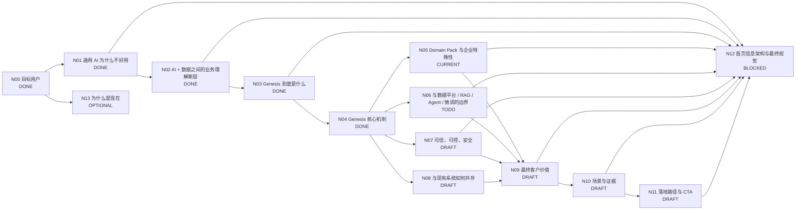

# Genesis 产品介绍 DAG

> 目标：把 Genesis 官网从“功能说明”整理为一个完整的客户认知闭环，并按 DAG 节点逐个定稿。

## 工作原则

- 首页优先服务：**已经想用 AI、甚至已经试过通用 AI，但发现进入真实企业业务后不好用**的业务负责人和技术负责人。
- 页面主线：**痛点 → 为什么会这样 → Genesis 补了什么 → 达成什么价值**。
- 不把 Genesis 讲成另一个大模型 / RAG / Agent / 数据平台。
- 不贬低现有技术，而是说明各层各自解决什么、Genesis 补哪一层。
- 首页先讲客户问题和业务价值；技术概念用于解释可信性、差异化和落地。
- 每个抽象概念必须能被真实业务 instance 解释；至少跨多个场景验证。

## 状态

- `DONE`：结论和表达已稳定。
- `CURRENT`：当前优先讨论。
- `DRAFT`：已有方向，待收敛。
- `TODO`：尚未正式讨论。
- `BLOCKED`：依赖前置节点。
- `OPTIONAL`：重要，但不阻塞首页主线。

## DAG



## 节点总表

| 节点 | 核心问题 | 状态 | 首页作用 |
|---|---|---|---|
| N00 目标用户 | 谁会觉得 Genesis 有价值？ | DONE | 决定全站语言 |
| N01 通用 AI 为什么不好用 | 为什么模型很聪明，一进企业业务就不好用？ | DONE | 建立痛点共识 |
| N02 业务理解断层 | 企业已有 AI 和数据平台，为什么还不够？ | DONE | 建立 Genesis 必要性 |
| N03 Genesis 是什么 | Genesis 补的是哪一层？ | DONE | 产品定位 |
| N04 核心机制 | 怎样把企业业务世界变成 AI 可使用的 Context 与 Capability？ | DONE | 方案解释 |
| N05 Domain Pack | 如何同时复用领域能力，又表达每家企业自己的工作方式？ | CURRENT | 差异化方案 |
| N06 边界比较 | 与数据平台、Semantic Layer、RAG、Agent、Fine-tuning 的关系？ | TODO | 避免错误归类 |
| N07 可信可控 | 为什么敢让 AI 判断和工作？ | DRAFT | 建立信任 |
| N08 系统共存 | 现有 ERP、CRM、数据平台、Agent 是否替换？ | DRAFT | 降低实施顾虑 |
| N09 最终价值 | 企业专属 AI 最终带来什么？ | DRAFT | 价值闭环 |
| N10 场景与证据 | 如何证明价值？ | DRAFT | Proof |
| N11 落地路径 | 客户怎样低成本开始？ | DRAFT | CTA |
| N12 首页结构 | 如何形成低认知负担的首页？ | BLOCKED | 最终页面 |
| N13 为什么是现在 | 为什么企业化成为新的 AI 瓶颈？ | OPTIONAL | 市场背景 |

---

# N00 DONE：目标用户

第一目标用户：业务负责人 / 管理者。已经使用豆包、DeepSeek、ChatGPT、Kimi 等通用 AI，认可模型能力，但发现真正进入公司业务时需要反复解释背景，回答也不敢直接用于判断和执行。

第二目标用户：技术团队 / AI 团队负责人。已有数据平台或正在建设知识库、RAG、Agent、Workflow，发现每个 AI 应用都在重复处理业务语义、规则、上下文、权限和事实。

共同触发场景：

> **我们想用 AI，也已经试过，但它一进入真正的企业业务就不好用了。**

---

# N01 DONE：通用 AI 为什么一进企业就不好用

用户感受到三个症状：

1. 每次都要重新解释公司背景和任务；
2. 给了资料、文档、数据也未必真正看懂；
3. 回答像那么回事，但涉及真实判断与执行时不敢用。

根因不是模型不聪明，而是缺少：

- **企业事实**：现在真正发生了什么；
- **业务语义与上下文**：这些信息在公司里意味着什么；
- **企业工作方式**：公司应该怎么判断、怎么做、什么不能做。

压缩为：

> **事实 → 理解 → 行动**

核心表达：

> **通用 AI 很聪明，但一到你的公司就不好用了。**

> **不是模型不够强，而是它没有你公司的企业事实、业务上下文和工作方式。**

---

# N02 DONE：AI + 数据之间的业务理解断层

企业已经有两端：Data 与 AI，但：

> **有 AI + 有企业数据，不自动等于企业 AI。**

因为：

> **数据不会自动变成业务含义，业务含义也不会自动变成企业判断和工作方式。**

对业务用户统一称：**业务理解层**。

技术下钻时解释为：

> **Business Semantics + Facts + Context + Rules / Methods / Boundaries**

稳定表达：

> **AI 缺的不是更多数据，而是知道这些数据在你的公司意味着什么。**

> **数据平台让数据可用；Genesis 让 AI 理解数据背后的业务世界。**

不宣称传统数据平台“没有语义”。成熟数据平台可能已经有数据目录、主数据、指标体系、Semantic Layer、Knowledge Graph。Genesis 的差异在于进一步形成 **AI-ready Business Context**，用于 AI 判断和工作。

---

# N03 DONE：Genesis 到底是什么

## 业务语言

> **Genesis 让通用 AI 真正理解你的公司。**

品牌表达：

> **大模型已经懂世界。Genesis 让它懂你的公司。**

## 一句话产品定义

> **Genesis 是连接企业业务世界与通用 AI 的企业业务理解平台。**

扩展：

> **它把企业自己的事实、业务语义、上下文、规则和工作方式，组织成 AI 可以持续理解和使用的业务上下文。**

## 技术语言

Genesis 是面向 AI 的企业业务语义与上下文平台，形成统一、持续、可治理、可复用的 **AI-ready Business Context**。

## Genesis 不是什么

- 不是另一个大模型；
- 不是数据平台替代品；
- 不是单纯知识库 / RAG；
- 不是单纯 Agent 平台。

Genesis 真正连接的是：

> **企业真实业务世界 ↔ 通用 AI。**

---

# N04 DONE：Genesis 核心机制

## 最终判断：不是单向流水线，而是“三部分结构”

### A. 长期沉淀：企业业务底座

Genesis 持续治理企业相对稳定的业务定义和工作方式：

1. **Business Model / Ontology**：对象、关系、语义、状态定义；
2. **Source Binding**：企业系统和数据如何映射到业务对象与事实；
3. **Rules / Methods / Boundaries**：企业判断方法、规则、阈值、流程、权限和边界；
4. **Capability Definitions**：可复用业务能力的输入、输出、规则、上下文要求、工具和权限。

这些内容长期存在、持续演进、可版本化。

### B. 运行时动态生成：Task Context

当用户或 Agent 发起具体任务时，Genesis 不把整个企业数据塞给模型，而是：

1. 理解当前任务和用户身份；
2. 解析相关业务对象；
3. 获取当前真实事实及 Evidence；
4. 根据对象关系、历史、规则、权限和任务目标动态组装 **Task Context / Business Context**。

因此：

> **Context 是当前任务所需的业务世界切片，而不是一个静态“大上下文数据库”。**

### C. 可复用并可执行：Business Capability

Capability 回答：

> **这家公司如何稳定、重复地完成某类判断或工作？**

Capability 是业务能力契约，而非普通 Prompt 或 API。它通常包含：

- 输入 / 输出；
- 所依赖的业务对象与语义；
- Context / Fact 要求；
- Rules / Methods；
- Evidence 要求；
- Permission / Boundary；
- 可调用的工具 / Actions；
- 人工确认条件。

例如：

- `CustomerRiskAssessment(customer_id)`
- `IncidentAssessAndRecommend(service_id)`
- `TrendStateAssessment(asset, strategy)`
- `LearningGapAndNextStep(student_id)`

同一 Capability 可以被 AI Assistant、Agent、App 和业务流程共同复用。

## 哪些长期沉淀，哪些动态生成

| 内容 | 状态 |
|---|---|
| Business Model / Ontology | 长期沉淀 |
| Source Binding | 长期沉淀 |
| Rules / Methods / Boundaries | 长期沉淀 |
| Capability Definition | 长期沉淀 |
| Fact | 混合：源系统持续变化，可实时查询、引用、物化或缓存 |
| Evidence Set | 运行时为主 |
| Task Context | 动态生成 |
| Capability Invocation | 动态执行 |

## Evidence 与 Permission 的位置

Evidence、Permission、Boundary 不是线性流程里的某一个步骤，而是横向约束：

- Fact 要有来源；
- Context 要受权限过滤；
- Judgment 要能回到 Evidence；
- Action 要满足 Permission / Boundary。

## 真实运行结构

```text
       企业业务底座（长期沉淀）
┌─────────────────────────────┐
│ Business Model / Ontology   │
│ Source Binding              │
│ Rules / Methods / Boundary  │
│ Capability Definitions      │
└─────────────────────────────┘
               │
        当前任务 / 当前用户
               ↓
      获取当前 Facts / Evidence
               ↓
        动态组装 Task Context
               ↓
       选择 / 调用 Capability
               ↓
       AI 判断 / Agent 执行
               ↓
   结果 + Evidence + 可选业务回写
```

## 首页压缩表达

首页不展示上述技术结构，只保留三层：

> **认识你的业务 → 知道真实发生了什么 → 按你的方式判断和工作**

与 N01 严格镜像：

| 通用 AI 的问题 | Genesis 补上的能力 |
|---|---|
| 不知道发生了什么 | 企业事实 |
| 不知道这意味着什么 | 业务模型 / 语义 / Context |
| 不知道该怎么做 | Rules / Methods / Capability |

## 场景化原则

所有抽象定义必须马上落到真实 instance。当前已用四个场景验证同一结构：企业经营、智能运维、投研、教育。完整例子见 `docs/product-concept-scenario-instances.md`。

---

# N05 CURRENT：Domain Pack 与企业特殊性

## 当前核心问题

如果 Genesis 已经有统一的 Business Model、Rules、Context 和 Capability，为什么还需要 Domain Pack？

需要解决四个问题：

1. 哪些能力可以在一个专业领域内复用？
2. 哪些内容必须由每家企业自己定义？
3. Domain Pack 是“行业模板”，还是“领域能力 + 企业适配”的组合？
4. Domain Pack 与 Ontology、Rules、Capability、Context 的关系是什么？

## 当前第一版假设

Domain Pack 不应该定义成固定行业模板，也不应该定义成一家公司完全私有的一包配置。

更合理的结构是三层：

### 1. Domain Baseline — 可复用的专业领域基础

可能包括：

- 领域常见业务对象、关系和术语；
- 常见指标与状态模型；
- 专业知识与判断框架；
- 常见 Evidence 类型；
- Capability 模板；
- 常见规则与方法的结构，但不是具体企业阈值。

### 2. Enterprise Overlay — 企业自己的业务方式

包括：

- 企业自己的对象定义和术语；
- 数据源 / 字段映射；
- 企业自己的指标、阈值、规则；
- 专家方法、策略、流程；
- 权限与审批边界；
- Capability 参数、覆盖和扩展。

### 3. Runtime Context — 当前任务和实时事实

Domain Pack 不应该固化当前业务事实。实时数据、事件和任务上下文由 Genesis 在运行时动态绑定。

因此当前候选公式：

> **Domain Pack = Domain Baseline × Enterprise Overlay**

运行时再叠加：

> **Domain Pack + Current Facts + Task Context → Enterprise-specific AI Capability**

## 下一步要验证

- 这个三层模型是否在金融、运维、教育、企业经营四个场景都成立；
- Domain Pack 是否应该包含 Capability Definitions；当前倾向：**应该包含领域 Capability 模板，企业再覆盖和实例化**；
- Domain Pack 是否应该包含数据；当前倾向：**不包含企业实时数据，只包含数据语义与映射结构**；
- 是否需要把“行业”统一改成“领域”，避免一个 Domain Pack 被误解为固定行业模板。

---

# N06 TODO：边界与比较

待处理：Data Platform、Semantic Layer、Knowledge Base / RAG、Fine-tuning、Agent / Workflow 分别解决什么，Genesis 与其如何协作。

# N07 DRAFT：可信、可控、安全

待定稿：Evidence、Fact provenance、权限过滤、Boundary、人审、冲突与不确定性处理。

# N08 DRAFT：与现有系统共存

原则：保留现有 ERP、CRM、数据库、数据平台、模型、Agent 和 App，Genesis 增加业务理解与能力层。

# N09 DRAFT：最终客户价值

候选：判断更可靠、工作更专业、真正能进入业务、企业能力可复用、减少重复建设。

# N10 DRAFT：场景与证据

要求每个场景都有：原来怎么做 → Genesis 如何介入 → 结果发生什么变化 → Evidence / 指标。

# N11 DRAFT：落地路径与 CTA

原则：从一个真实、高价值业务问题开始，跑通闭环，再沉淀并复用能力。

# N12 BLOCKED：首页信息架构与视觉

关键主节点定稿后统一重构，不按内部模块顺序堆页面。

# N13 OPTIONAL：为什么是现在

核心背景：模型能力已足够强，企业 AI 的主要瓶颈逐步从“模型够不够强”转为“有没有企业业务上下文与可复用能力”。

---

## 更新记录

- 2026-09-03：创建产品介绍 DAG。
- 2026-09-03：N00 目标用户定稿。
- 2026-09-03：N01 定稿为“企业事实 → 业务理解 → 工作方式”的缺失。
- 2026-09-03：N02 定稿为 AI 与 Data 之间的业务理解断层。
- 2026-09-03：N03 定稿为“连接企业业务世界与通用 AI 的企业业务理解平台”。
- 2026-09-03：N04 定稿。核心机制确立为“长期业务底座 + 动态 Task Context + 可复用 Business Capability”，并明确 Evidence / Permission 为横向约束。
- 2026-09-03：进入 N05 Domain Pack，开始验证“Domain Baseline × Enterprise Overlay”的定义。