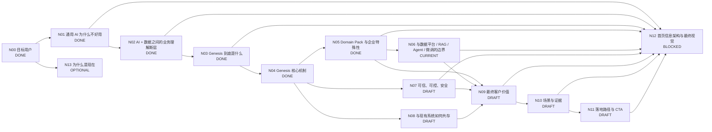

# Genesis 产品介绍 DAG

> 目标：把 Genesis 官网从“功能说明”整理为一个完整的客户认知闭环，并按 DAG 节点逐个定稿。

## 工作原则

- 首页优先服务：**已经想用 AI、甚至已经试过通用 AI，但发现进入真实企业业务后不好用**的业务负责人和技术负责人。
- 页面主线：**痛点 → 为什么会这样 → Genesis 补了什么 → 达成什么价值**。
- 不把 Genesis 讲成另一个大模型 / RAG / Agent / 数据平台。
- 不贬低现有技术，而是说明各层各自解决什么、Genesis 补哪一层。
- 首页先讲客户问题和业务价值；技术概念用于解释可信性、差异化和落地。
- 每个抽象概念必须能被真实业务 instance 解释；至少跨多个场景验证。

## 状态

- `DONE`：结论和表达已稳定。
- `CURRENT`：当前优先讨论。
- `DRAFT`：已有方向，待收敛。
- `TODO`：尚未正式讨论。
- `BLOCKED`：依赖前置节点。
- `OPTIONAL`：重要，但不阻塞首页主线。

## DAG



## 节点总表

| 节点 | 核心问题 | 状态 | 首页作用 |
|---|---|---|---|
| N00 目标用户 | 谁会觉得 Genesis 有价值？ | DONE | 决定全站语言 |
| N01 通用 AI 为什么不好用 | 为什么模型很聪明，一进企业业务就不好用？ | DONE | 建立痛点共识 |
| N02 业务理解断层 | 企业已有 AI 和数据平台，为什么还不够？ | DONE | 建立 Genesis 必要性 |
| N03 Genesis 是什么 | Genesis 补的是哪一层？ | DONE | 产品定位 |
| N04 核心机制 | 怎样把企业业务世界变成 AI 可使用的 Context 与 Capability？ | DONE | 方案解释 |
| N05 Domain Pack | 如何同时复用领域能力，又表达每家企业自己的工作方式？ | DONE | 差异化方案 |
| N06 边界比较 | 与数据平台、Semantic Layer、RAG、Agent、Fine-tuning 的关系？ | CURRENT | 避免错误归类 |
| N07 可信可控 | 为什么敢让 AI 判断和工作？ | DRAFT | 建立信任 |
| N08 系统共存 | 现有 ERP、CRM、数据平台、Agent 是否替换？ | DRAFT | 降低实施顾虑 |
| N09 最终价值 | 企业专属 AI 最终带来什么？ | DRAFT | 价值闭环 |
| N10 场景与证据 | 如何证明价值？ | DRAFT | Proof |
| N11 落地路径 | 客户怎样低成本开始？ | DRAFT | CTA |
| N12 首页结构 | 如何形成低认知负担的首页？ | BLOCKED | 最终页面 |
| N13 为什么是现在 | 为什么企业化成为新的 AI 瓶颈？ | OPTIONAL | 市场背景 |

---

# N00 DONE：目标用户

第一目标用户：业务负责人 / 管理者。已经使用豆包、DeepSeek、ChatGPT、Kimi 等通用 AI，认可模型能力，但发现真正进入公司业务时需要反复解释背景，回答也不敢直接用于判断和执行。

第二目标用户：技术团队 / AI 团队负责人。已有数据平台或正在建设知识库、RAG、Agent、Workflow，发现每个 AI 应用都在重复处理业务语义、规则、上下文、权限和事实。

共同触发场景：

> **我们想用 AI，也已经试过，但它一进入真正的企业业务就不好用了。**

---

# N01 DONE：通用 AI 为什么一进企业就不好用

根因不是模型不聪明，而是缺少：

- **企业事实**：现在真正发生了什么；
- **业务语义与上下文**：这些信息在公司里意味着什么；
- **企业工作方式**：公司应该怎么判断、怎么做、什么不能做。

压缩为：

> **事实 → 理解 → 行动**

核心表达：

> **通用 AI 很聪明，但一到你的公司就不好用了。**

> **不是模型不够强，而是它没有你公司的企业事实、业务上下文和工作方式。**

---

# N02 DONE：AI + 数据之间的业务理解断层

> **有 AI + 有企业数据，不自动等于企业 AI。**

因为：

> **数据不会自动变成业务含义，业务含义也不会自动变成企业判断和工作方式。**

对业务用户统一称：**业务理解层**。

技术下钻：

> **Business Semantics + Facts + Context + Rules / Methods / Boundaries**

稳定表达：

> **AI 缺的不是更多数据，而是知道这些数据在你的公司意味着什么。**

> **数据平台让数据可用；Genesis 让 AI 理解数据背后的业务世界。**

Genesis 不替代成熟 Data Platform 或传统 Semantic Layer，而是进一步形成 **AI-ready Business Context**。

---

# N03 DONE：Genesis 到底是什么

业务语言：

> **Genesis 让通用 AI 真正理解你的公司。**

品牌表达：

> **大模型已经懂世界。Genesis 让它懂你的公司。**

产品定义：

> **Genesis 是连接企业业务世界与通用 AI 的企业业务理解平台。**

技术解释：Genesis 将企业事实、业务语义、上下文、规则和工作方式组织成统一、持续、可治理、可复用的 **AI-ready Business Context**。

Genesis 不是另一个大模型、数据平台替代品、单纯知识库/RAG 或单纯 Agent 平台。

---

# N04 DONE：Genesis 核心机制

## 三部分结构

### 1. 长期沉淀：企业业务底座

- Business Model / Ontology；
- Source Binding；
- Rules / Methods / Boundaries；
- Capability Definitions。

### 2. 动态生成：Task Context

当前任务到来后，Genesis 解析用户、意图和业务对象，获取当前 Facts / Evidence，结合关系、历史、规则和权限动态形成当前任务所需的 Context。

> **Context 是当前任务需要的业务世界切片，不是静态的大上下文数据库。**

### 3. 可复用执行：Business Capability

Capability 是可复用业务能力契约，包含输入输出、业务语义、Context 要求、Rules / Methods、Evidence、Permission、Actions 和人工确认条件。

例如：

- `CustomerRiskAssessment(customer_id)`
- `IncidentAssessAndRecommend(service_id)`
- `TrendStateAssessment(asset, strategy)`
- `LearningGapAndNextStep(student_id)`

Evidence、Permission 和 Boundary 是横向约束，而不是线性流程里的一个单独步骤。

运行结构：

```text
企业业务底座
    ↓
当前任务 / 当前用户
    ↓
Facts + Evidence
    ↓
Task Context
    ↓
Capability
    ↓
AI 判断 / Agent 执行
    ↓
结果 + Evidence + 可选业务回写
```

首页压缩为：

> **认识你的业务 → 知道真实发生了什么 → 按你的方式判断和工作**

完整场景见 `docs/product-concept-scenario-instances.md`。

---

# N05 DONE：Domain Pack 与企业特殊性

## 最终定义

> **Domain Pack 是把一个专业领域的可复用业务模型与能力，按照某家企业自己的数据、规则、方法和边界完成企业化配置。**

传播表达：

> **专业领域共性 × 企业自己的工作方式。**

因此：

> **同一个领域，不同企业，会形成不同的 Domain Pack。**

## 三层边界

### A. Domain Baseline / Blueprint：可复用领域基础

包括：

- 常见业务对象与关系；
- 领域术语与语义；
- 标准指标 / 状态模型；
- 专业知识与判断框架；
- Evidence 类型；
- Rule / Method 结构；
- Capability 模板；
- Context 模板。

这里复用的是“结构和专业框架”，不是强迫所有企业采用同样的具体规则。

### B. Enterprise Overlay：企业自己的工作方式

包括：

- 企业自己的对象扩展和术语；
- 数据源 / 字段映射；
- 指标口径；
- 企业阈值与规则；
- 专家方法 / 策略；
- 流程；
- 权限与审批边界；
- Capability 参数、覆盖与扩展。

因此：

```text
Domain Blueprint
      +
Enterprise Overlay
      ↓
Company-specific Domain Pack
```

### C. Runtime Facts / Context：当前发生的事情

Domain Pack 不固化企业当前实时事实。订单状态、市场行情、CPU、学生成绩等持续变化信息，由 Genesis 在运行时连接真实来源并动态形成 Context。

完整关系：

```text
Company-specific Domain Pack
           +
 Current Facts / Task Context
           ↓
 Enterprise-specific AI Capability
```

## Domain Pack 的产品位置

Domain Pack 不是 Genesis 之外的第三套平台，也不是独立运行层。它是 Genesis 业务理解层中的**领域化 / 企业化配置与能力包**，可组织或引用 Ontology、Semantics、Source Mapping、Rules、Context Templates、Evidence Requirements、Capability Definitions 和 Permission Policies。

## 跨场景验证

金融、运维、教育、企业经营都符合：

> **领域共性可以复用，企业方法必须企业化，当前事实必须运行时绑定。**

完整映射见 `docs/domain-pack-scenario-mapping.md`。

## 首页表达候选

标题：

> **同一个领域，每家公司都有自己的工作方式。**

解释：

> **Domain Pack 把专业领域的通用模型和能力，与企业自己的数据、规则、方法和边界结合，让 AI 不只懂这个领域，更懂你们公司是怎么做这个领域的。**

核心传播句：

> **专业是共性的，工作方式是你的。**

---

# N06 CURRENT：与现有技术的边界与比较

## 当前必须回答

1. 传统 Data Platform 已经有数据治理、Semantic Layer、Knowledge Graph，Genesis 新增的到底是什么？
2. Knowledge Base / RAG 已经能把企业资料给 AI，Genesis 为什么还需要存在？
3. Fine-tuning 能让模型学会企业知识和风格，为什么不能替代 Genesis？
4. Agent / Workflow 已经能调用工具、执行任务，Genesis 与它们是什么上下游关系？
5. Genesis 是否应该与这些技术竞争，还是作为它们共同使用的业务理解与能力基础？

## 初步原则

N06 不做“Genesis 比所有技术更高级”的比较，而做**职责分层**：

- Data Platform：让数据可治理、可计算、可访问；
- Semantic Layer / Knowledge Graph：让数据与概念有稳定语义和关系；
- Knowledge Base / RAG：为当前问题检索相关信息；
- Fine-tuning：改变模型行为、表达和部分能力倾向；
- LLM：推理、语言理解和生成；
- Agent / Workflow：编排工具并执行任务；
- Genesis：把企业业务语义、当前事实、规则、上下文和 Capability 统一组织成 **AI 可持续使用的企业业务基础**。

N06 下一步重点是检查这套比较是否严谨，尤其避免夸大 Semantic Layer、RAG 或 Fine-tuning 的边界。

---

# N07 DRAFT：可信、可控、安全

待定稿：Evidence、Fact provenance、权限过滤、Boundary、人审、冲突与不确定性处理。

# N08 DRAFT：与现有系统共存

原则：保留现有 ERP、CRM、数据库、数据平台、模型、Agent 和 App，Genesis 增加业务理解与能力层。

# N09 DRAFT：最终客户价值

候选：判断更可靠、工作更专业、真正能进入业务、企业能力可复用、减少重复建设。

# N10 DRAFT：场景与证据

要求每个场景都有：原来怎么做 → Genesis 如何介入 → 结果发生什么变化 → Evidence / 指标。

# N11 DRAFT：落地路径与 CTA

原则：从一个真实、高价值业务问题开始，跑通闭环，再沉淀并复用能力。

# N12 BLOCKED：首页信息架构与视觉

关键主节点定稿后统一重构，不按内部模块顺序堆页面。

# N13 OPTIONAL：为什么是现在

核心背景：模型能力已足够强，企业 AI 的主要瓶颈逐步从“模型够不够强”转为“有没有企业业务上下文与可复用能力”。

---

## 更新记录

- 2026-09-03：创建产品介绍 DAG。
- 2026-09-03：N00 目标用户定稿。
- 2026-09-03：N01 定稿为“企业事实 → 业务理解 → 工作方式”的缺失。
- 2026-09-03：N02 定稿为 AI 与 Data 之间的业务理解断层。
- 2026-09-03：N03 定稿为“连接企业业务世界与通用 AI 的企业业务理解平台”。
- 2026-09-03：N04 定稿为“长期业务底座 + 动态 Task Context + 可复用 Business Capability”。
- 2026-09-03：N05 定稿。Domain Pack 定义为 Domain Blueprint + Enterprise Overlay；当前事实与 Task Context 在运行时绑定。
- 2026-09-03：进入 N06，开始梳理 Genesis 与 Data Platform、Semantic Layer、RAG、Fine-tuning、Agent 的职责边界。