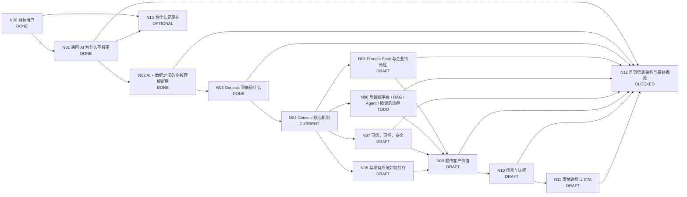

# Genesis 产品介绍 DAG

> 目标：把 Genesis 的官网产品介绍从“功能说明”整理为一个完整的客户认知闭环。后续按 DAG 节点逐个讨论、定稿，并在完成后同步到首页。

## 工作原则

- 首页优先服务：**已经想用 AI、甚至已经试过通用 AI，但发现进入真实企业业务后不好用**的业务负责人和技术负责人。
- 页面主线始终是：**痛点 → 为什么会这样 → Genesis 补了什么 → 达成什么价值**。
- 不把 Genesis 讲成“另一个大模型 / RAG / Agent / 数据平台”。
- 不贬低现有技术。重点解释各层分别解决什么问题，以及 Genesis 补的是哪一层。
- 首页先讲客户问题和商业价值，技术术语用于后续解释“为什么可信、为什么不同、怎么落地”。
- 一次只定稿一个主节点；节点必须有：结论、用户疑问、回答方式、页面表达、验收标准。

## 状态

- `DONE`：结论和表达已基本稳定。
- `CURRENT`：当前优先讨论。
- `DRAFT`：已有方向，待收敛。
- `TODO`：尚未正式讨论。
- `BLOCKED`：依赖前置节点。
- `OPTIONAL`：重要，但不阻塞首页主线。

## DAG



## 节点总表

| 节点 | 核心问题 | 状态 | 首页作用 |
|---|---|---|---|
| N00 目标用户 | 谁会觉得 Genesis 有价值？ | DONE | 决定全站语言 |
| N01 通用 AI 为什么不好用 | 为什么模型很聪明，一进企业业务就不好用？ | DONE | 建立痛点共识 |
| N02 AI + 数据之间的业务理解断层 | 企业已经有数据平台和 AI，为什么还是不够？ | DONE | 建立 Genesis 必要性 |
| N03 Genesis 到底是什么 | Genesis 补的是哪一层？一句话怎么定义？ | DONE | 产品定位 |
| N04 Genesis 核心机制 | 怎样把企业业务世界持续组织成 AI 可理解、可使用的上下文与能力？ | CURRENT | 方案解释 |
| N05 Domain Pack | 如何结合专业领域能力与企业自身特殊业务？ | DRAFT | 差异化方案 |
| N06 边界与比较 | 与数据平台、Semantic Layer、知识库、RAG、Agent、Fine-tuning 是什么关系？ | TODO | 避免错误归类 |
| N07 可信可控 | 为什么敢让 AI 判断和工作？ | DRAFT | 建立信任 |
| N08 系统共存 | ERP、CRM、数据平台、Agent 等是否需要替换？ | DRAFT | 降低实施顾虑 |
| N09 最终价值 | 企业专属 AI 最终给客户带来什么？ | DRAFT | 价值闭环 |
| N10 场景与证据 | 在真实工作中如何证明？ | DRAFT | Proof |
| N11 落地路径 | 客户如何低成本开始？ | DRAFT | CTA |
| N12 首页结构 | 上述结论如何形成低认知负担的首页？ | BLOCKED | 最终页面 |
| N13 为什么是现在 | 为什么企业化成为新的 AI 瓶颈？ | OPTIONAL | 市场背景 |

---

# N00 DONE：目标用户

## 第一目标用户

业务负责人 / 管理者：

- 已经使用豆包、DeepSeek、ChatGPT、Kimi 等通用 AI。
- 认可模型能力，但发现真正问公司业务时，需要不断解释背景，回答也不敢直接用于判断和执行。
- 诉求不是“再买一个 AI”，而是：**有没有 AI 真正懂我的业务，并能长期参与工作？**

## 第二目标用户

技术团队 / AI 团队负责人：

- 已经有数据平台，或正在建设知识库、RAG、Agent、Workflow 等能力。
- 发现每个 AI 应用都在重复处理业务语义、字段含义、规则、上下文、权限和事实。
- 诉求是：**能否建立统一、持续、可复用的企业业务理解层，让不同模型、Agent 和应用共同使用？**

共同触发场景：

> **我们想用 AI，也已经试过，但它一进入真正的企业业务就不好用了。**

---

# N01 DONE：通用 AI 为什么一进企业业务就不好用

## 用户感受到的症状

1. **每次都要重新解释**：公司背景、术语、客户、项目、当前任务需要反复告诉 AI。
2. **给了资料也未必真正看懂**：拿到文档、数据库字段，不等于知道其业务含义。
3. **回答像那么回事，但不敢真用**：AI 不知道企业自己的判断标准、工作方式和边界。

## 根因

不是模型不够聪明，而是通用 AI 天生缺少企业私有的三层信息：

1. **企业事实**：现在真正发生了什么。
2. **业务语义与上下文**：这些信息在这家公司意味着什么。
3. **企业工作方式**：这家公司遇到这种情况应该怎么判断和工作。

压缩为：

> **事实 → 理解 → 行动**

即：

> **不知道发生了什么 → 不知道这意味着什么 → 不知道该怎么做。**

核心表达：

> **通用 AI 很聪明，但一到你的公司就不好用了。**

> **不是模型不够强，而是它没有你公司的企业事实、业务上下文和工作方式。**

---

# N02 DONE：AI + 数据之间的业务理解断层

## 最终结论

企业往往已经有两端：

- **Data**：ERP、CRM、数据库、数据仓库、Lakehouse、文档、日志、指标体系。
- **AI**：DeepSeek、Qwen、GPT、Claude，以及其上的 RAG、Agent、Workflow。

真正的问题不是两端能力不足，而是中间经常缺少一层**面向 AI 的企业业务理解**。

> **有 AI + 有企业数据，不自动等于企业 AI。**

因为：

> **数据不会自动变成业务含义，业务含义也不会自动变成企业判断和工作方式。**

### 对业务用户：统一叫“业务理解层”

首页不并列使用“知识层 / 语义层 / 认知层”等多个概念，而统一表达为：

> **企业在数据和 AI 之间，缺少让 AI 真正理解业务的那一层。**

一句核心表达：

> **AI 缺的不是更多数据，而是知道这些数据在你的公司意味着什么。**

### 对技术负责人：解释其组成

业务理解层不是一个抽象黑盒，它主要由以下信息共同构成：

> **Business Semantics + Facts + Context + Rules / Methods / Boundaries**

即：

- **Semantics**：对象、关系、字段、指标、状态的业务含义；
- **Facts**：当前什么是真的、来源是什么、有效时间是什么；
- **Context**：历史、任务、客户、项目和当前事件所处的业务背景；
- **Rules / Methods / Boundaries**：企业如何判断、如何工作，以及权限和边界。

这里明确区分：

- **知识（Knowledge）**是输入内容之一，不等于整层；
- **语义（Semantics）**负责表达业务含义，是整层的重要基础；
- **认知（Cognition）**是 AI 使用上述上下文之后形成的理解和判断能力，不应被描述为 Genesis 静态“存储”的一层。

## 与传统数据平台的准确关系

不能说传统数据平台“没有语义”。成熟数据平台可能已经具备数据目录、主数据、指标体系、BI Semantic Layer、Knowledge Graph 和数据治理。

真正的差异是**服务对象和使用深度**：

> **传统数据平台主要让数据可管理、可计算、可查询、可供人和数据应用使用；Genesis 进一步把企业事实、业务语义、上下文、规则和工作方式组织成 AI 可以持续理解、判断和使用的业务上下文。**

因此 Genesis 不是传统 Semantic Layer 的替代，而是在 AI 进入真实业务后补充一个更完整的 **AI-ready Business Context**。

## 推荐架构模型

```text
业务系统 / 企业数据
        ↓
    Data Platform
        ↓
 Genesis：Business Understanding / AI-ready Business Context
        ↓
      AI / LLM
        ↓
   Agent / Application
```

一句人话：

> **数据平台把数据准备好；Genesis 把业务讲明白；大模型负责思考；Agent 负责干活。**

另一个稳定表达：

> **数据平台让数据可用；Genesis 让 AI 理解数据背后的业务世界。**

## N02 验收结果

- 不把数据平台描述成低级或“没有语义”。
- 不把 Genesis 简化成传统 Semantic Layer。
- 不混用知识、语义、认知三个概念。
- 业务用户能理解“为什么把数据给 AI 仍不等于 AI 懂业务”。
- 技术负责人能看出 Genesis 补的是面向 AI 工作的统一业务上下文层。

---

# N03 DONE：Genesis 到底是什么

## 最终定位：一个产品定位，三种解释深度

### A. 面向业务用户

> **Genesis 让通用 AI 真正理解你的公司。**

品牌化表达：

> **大模型已经懂世界。Genesis 让它懂你的公司。**

“把你的公司教给 AI”可作为口语化比喻，但不作为正式产品定义，以免让用户误以为需要重新训练模型。

### B. 一句话产品定义

> **Genesis 是连接企业业务世界与通用 AI 的企业业务理解平台。**

这里使用“企业业务世界”，而不是仅说“企业数据”，因为 Genesis 连接的不只有数据，还包括业务含义、事实、上下文、规则、方法和边界。

扩展解释：

> **它把企业自己的事实、业务语义、上下文、规则和工作方式，组织成 AI 可以持续理解和使用的业务上下文。**

### C. 面向技术负责人

> **Genesis 是面向 AI 的企业业务语义与上下文平台，形成统一、持续、可治理、可复用的 AI-ready Business Context。**

业务语言中的“业务理解平台”和技术语言中的“Business Semantic & Context / AI Business Context”不是三个不同定位，而是同一个产品定位的不同解释深度。

## 产品位置

```text
Enterprise Business World
数据 · 系统 · 文档 · 业务语义 · 规则 · 方法
                 ↓
              Genesis
     Business Understanding / Context
                 ↓
          LLM / AI Models
                 ↓
       Agents / Applications
```

Genesis 真正连接的是：

> **企业真实业务世界 ↔ 通用 AI。**

## Genesis 不是什么

- **不是另一个大模型**：继续使用 DeepSeek、Qwen、GPT、Claude 等主流模型。
- **不是数据平台替代品**：继续使用现有数据库、Lakehouse、数据治理和指标体系。
- **不是单纯知识库 / RAG**：知识检索是能力之一，但完整业务理解还需要事实、关系、上下文、规则、方法、证据和边界。
- **不是单纯 Agent 平台**：Agent 负责完成任务；Genesis 提供判断和工作所需的企业业务上下文与能力。

## N03 验收结果

- 业务负责人通过“企业业务理解平台”可以大致理解 Genesis 的用途。
- 技术负责人可以判断 Genesis 位于企业业务世界与 AI / Agent 之间，并与现有 Data Platform 协作。
- 产品定义不依赖 Ontology、GraphRAG 等技术术语。
- 不自然落入“知识库”“Agent 平台”“企业大模型训练平台”的错误分类。
- 对外只有一个定位，业务语言与技术语言只是不同解释深度。

---

# N04 CURRENT：Genesis 核心机制

## 当前要解决的问题

N03 已经回答“Genesis 是什么”。N04 要回答的是：

> **Genesis 到底怎样把一个企业复杂、动态、分散的业务世界，变成 AI 在每一次任务中都能正确理解和使用的业务上下文？**

这里必须避免把 Genesis 讲成一条简单的 ETL 流水线，也不能直接堆 Data Platform、Ontology Platform、GraphRAG、Evidence、API 等模块名称。

## 第一轮核心判断：不是一条流水线，而是“长期建立业务世界 + 运行时动态组装上下文”

企业业务理解不是一次转换完成的。Genesis 实际上需要同时解决两个不同问题：

### A. 长期存在的“企业业务世界”

Genesis 持续维护企业相对稳定和持续变化的业务基础：

1. **业务模型**：什么是什么，以及彼此有什么关系；
2. **企业事实**：现在真实发生了什么，以及来源和时间；
3. **企业工作方式**：规则、指标、方法、权限和边界。

### B. 每一次任务所需要的“当前上下文”

AI 不应该在每次任务中把整个企业数据、全部知识和所有规则都塞进 Prompt。

Genesis 应该根据当前问题 / 任务，动态找到并组合：

> **当前相关对象 + 当前事实 + 业务关系 + 适用规则 / 方法 + 证据 + 权限边界**

形成一个当前任务可直接使用的 **Task Context / Business Context**，再提供给 LLM / Agent。

因此更准确的运行逻辑是：

```text
        企业业务世界（持续维护）
  ┌─────────────────────────┐
  │ 业务模型 / 语义          │
  │ 当前事实 / Evidence      │
  │ 规则 / 方法 / 权限 / 边界 │
  └─────────────────────────┘
               ↓
          当前业务任务
               ↓
      Genesis 动态组装上下文
               ↓
       AI 理解 / 推理 / 判断
               ↓
        Agent / App 完成工作
```

## 建议把 Genesis 核心机制压缩成“四个动作”

### 1. 建立业务模型 — Know what things mean

把企业里的客户、合同、订单、项目、设备、课程、资产等业务对象，以及它们之间的关系和字段含义组织起来。

回答：

> **什么是什么？彼此什么关系？**

这部分技术上可以由 Ontology、Semantic Model、Graph 等能力承载，但首页不先讲这些术语。

### 2. 绑定真实事实 — Know what is happening

把数据库、业务系统、文档、事件和实时数据映射到业务模型中，并保留来源、时间、状态和证据。

回答：

> **现在真正发生了什么？哪些是可信事实？**

重点不是复制所有数据，而是让 AI 能够在业务语义下访问和理解当前事实。

### 3. 注入企业工作方式 — Know how your company works

把企业自己的规则、指标、判断方法、流程、权限和边界与业务对象和事实关联起来。

回答：

> **遇到这种情况，这家公司通常怎么判断、怎么做？什么不能做？**

Domain Pack 会在 N05 进一步解释“专业领域通用能力 × 企业特殊配置”如何进入这一层。

### 4. 按任务动态提供上下文 — Give AI only what it needs now

当 AI / Agent 面对具体问题或任务时，Genesis 根据任务动态组合相关对象、事实、关系、规则、方法、证据和边界，形成 AI 当前可直接使用的业务上下文。

回答：

> **这一次任务，AI 现在应该知道什么？依据什么？按什么规则工作？**

这是 Genesis 与“把所有数据直接交给模型”以及“单次 Prompt 手工解释背景”的关键区别。

## 一个更简洁的业务表达

如果首页只能讲三步，可以进一步压缩成：

> **认识你的业务 → 知道真实发生了什么 → 按你的方式判断和工作**

Genesis 在运行时再把这三类能力针对当前任务组合给 AI。

这与 N01 的痛点形成严格镜像：

| 通用 AI 的缺失 | Genesis 补上的能力 |
|---|---|
| 不知道发生了什么 | 真实业务事实 |
| 不知道这意味着什么 | 业务模型、语义和上下文 |
| 不知道该怎么做 | 企业规则、方法和边界 |

## 当前需要进一步检查的问题

1. “业务模型 → 事实 → 工作方式 → Task Context”是不是最准确的四段机制，还是应该把 Evidence 单独提升？
2. Evidence 是事实的一部分、可信机制的一部分，还是应该在 N07 可信可控节点重点展开？当前倾向：**N04 中作为事实与上下文的属性出现，N07 再重点讲可信性。**
3. 权限与边界应该属于企业工作方式还是 Trust 层？当前倾向：**业务机制中必须存在，N07 再解释如何治理。**
4. 是否需要在 N04 明确 Context 是“动态组装”而非一个静态大对象？当前倾向：**必须明确，这是 Genesis 机制的重要差异。**
5. “Capability”什么时候出现最合适？当前倾向：N04 先解释 Context 如何形成，N09 再强调这些上下文与规则可以沉淀成可复用业务能力。

## N04 验收标准

- 业务用户能理解 Genesis 不是简单“接数据给 AI”，而是在持续建立企业业务世界。
- 技术负责人能理解“持久业务模型 / 事实 / 规则”与“运行时 Task Context”的区别。
- 机制不依赖具体底层技术名也成立。
- 能自然承接 N05 Domain Pack、N07 Evidence / Trust、N08 系统集成。
- 首页最终可以压缩为不超过三步，而技术页面可以下钻到四个动作。

---

## 更新记录

- 2026-09-03：创建产品介绍 DAG。
- 2026-09-03：N00 目标用户定稿。
- 2026-09-03：N01 通用 AI 不好用的根因定稿为“企业事实 → 业务理解 → 工作方式”。
- 2026-09-03：N02 定稿。统一对外使用“业务理解层”，技术下钻定义为 AI-ready Business Context；明确 Knowledge / Semantics / Cognition 的关系，并避免与传统 Semantic Layer 错误对立。
- 2026-09-03：N03 定稿。产品定义为“连接企业业务世界与通用 AI 的企业业务理解平台”；技术定义为面向 AI 的企业业务语义与上下文平台。
- 2026-09-03：进入 N04。初步确定核心机制不是单向流水线，而是“持续维护企业业务世界 + 针对当前任务动态组装 AI Business Context”。