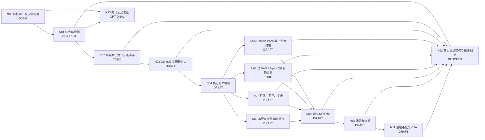

# Genesis 产品介绍 DAG

> 目标：把 Genesis 的官网产品介绍从“功能说明”整理为一个完整的客户认知闭环。后续按 DAG 节点逐个讨论、定稿，并在完成后同步到首页。

## 工作原则

- 一次只解决一个主节点，不同时发散多个主题。
- 每个节点必须形成“结论 + 用户会问什么 + 我们怎么回答 + 页面怎么表达 + 验收标准”。
- 节点未达到验收标准，不进入 `DONE`。
- 首页优先服务**已经想用 AI、甚至已经试过通用 AI，但发现进入真实企业业务后不好用**的人。
- 页面文案优先站在客户视角，不先讲平台术语。
- 技术术语仅用于解释“为什么可信 / 为什么不同 / 怎么落地”。
- 所有最终页面表达都要回到一个主线：**痛点 → Genesis 方案 → 达成的价值**。
- 首页不是技术架构文档。客户应先理解“为什么需要 Genesis”，再理解“Genesis 怎么做到”。

## 状态定义

- `ASSUMED`：已有合理假设，但尚未专门确认。
- `DRAFT`：已有初步答案，仍需讨论和收敛。
- `CURRENT`：当前优先解决节点。
- `TODO`：尚未开始。
- `DONE`：结论、表达和验收标准均已满足。
- `BLOCKED`：依赖前置节点，暂不处理。
- `OPTIONAL`：重要，但不阻塞首页主叙事。

## DAG

## 节点清单

| 节点 | 关键问题 | 当前状态 | 页面落点 | 完成标准 |
|---|---|---|---|---|
| N00 目标用户与决策场景 | 首页首先说服谁？他们已经尝试过什么？为什么会来找新的方案？ | DONE | 全站语气、信息深度、CTA | 明确第一目标读者、第二目标读者、共同触发场景和首页不优先服务谁 |
| N01 痛点与根因 | 为什么豆包、DeepSeek、ChatGPT 等通用 AI 平时很好用，一进入公司业务就不好用？ | CURRENT | 首屏第一段 / 痛点区 | 形成用户能立即认同的症状 + 一条不依赖技术术语的根因链；明确问题不是模型不够聪明 |
| N02 现有办法为什么还不够 | Prompt、上传文档、知识库、RAG、Agent 为什么改善了一部分，却仍经常无法真正进入业务？ | TODO | 痛点后 / 差距区 | 不贬低现有技术，说明它们各自解决一部分问题，但“持续统一的企业业务理解与工作能力”仍然缺失 |
| N03 Genesis 到底是什么 | Genesis 属于什么产品类别？一句话怎么定义？它不是什么？ | DRAFT | 产品定义区 | 形成一句稳定产品定义 + 一句“不是什么”，避免被误解为知识库、Agent、大模型或单纯数据平台 |
| N04 核心方案机制 | Genesis 到底给通用 AI 补了什么？怎样把企业业务世界持续提供给 AI？ | DRAFT | 方案区 / 能力架构 | 形成“企业事实 → 业务理解 → 工作方式 → AI 可用能力”的机制，不落成功能清单 |
| N05 Domain Pack 与企业特殊性 | Domain Pack 是行业模板，还是“专业领域 × 企业特殊业务”的配置？ | DRAFT | 方案区 / Domain Pack 区 | 明确定义 Domain Pack；说明同一领域为什么不同公司配置不同，以及哪些部分可复用、哪些必须企业化 |
| N06 与 RAG / Agent / 微调的边界 | RAG、知识库、Agent、Fine-tuning 分别解决什么？Genesis 补哪一层？ | TODO | 差异化区 / 技术下钻 | 用客户能理解的对比说清关系；强调协作而非替代；形成一句核心差异化 |
| N07 可信、可控、安全 | 为什么结果值得信？数据不足怎么办？权限、证据、边界、人审怎么处理？ | DRAFT | Trust / Evidence 区 | 回答“会不会胡说、乱做、越权”；形成可解释、可追溯、可控的原则 |
| N08 与现有系统如何共存 | ERP、CRM、数据库、数据平台、知识库、Agent、App 是否要替换？Genesis 放在哪里？ | DRAFT | 架构 / 集成区 | 一张图讲清“保留现有系统，Genesis 在中间增加企业业务理解与能力层” |
| N09 最终客户价值 | 企业专属 AI 最终带来什么，而不只是“懂业务”？ | DRAFT | 首屏第三段 / Value 区 | 从能力上升到结果：判断更可靠、工作更专业、真正进入业务、能力可持续复用、降低重复建设与风险 |
| N10 场景与证据 | 在哪些真实工作里能证明上面的价值？有没有前后对比、POC、案例或指标？ | DRAFT | 场景区 / Proof 区 | 每个场景至少有“原来怎么做 → Genesis 如何介入 → 结果发生什么变化”；逐步补案例和数据证据 |
| N11 落地路径与 CTA | 客户怎么开始？是不是先做大规模数据治理/本体建设？第一步是什么？ | DRAFT | 结尾 CTA | 形成低门槛路径：从一个真实问题/闭环开始，再沉淀复用；CTA 明确具体 |
| N12 首页信息架构与最终视觉 | 上述答案如何排成一个低认知负担的官网？首图、区块顺序、视觉隐喻是什么？ | BLOCKED | `index.html` | 主链关键节点定稿后统一重构；页面顺序符合客户自然提问顺序，而不是平台内部模块顺序 |
| N13 为什么是现在 | 为什么现在企业 AI 的瓶颈从“模型能力”转向“企业化”？ | OPTIONAL | 市场背景 / 销售材料 | 能解释 timing，但不抢首页主叙事；首页可不单独成区 |

## N00 已定稿：目标用户与决策场景

### 第一目标用户：业务负责人 / 管理者

典型状态：

- 想把 AI 用进真实业务，而不只是聊天、写文案、做摘要。
- 已经用过豆包、DeepSeek、ChatGPT、Kimi 等通用 AI，觉得模型“很聪明”。
- 但一问到公司自己的业务，就需要反复解释背景，或者回答看起来合理却不敢真正采用。
- 真正诉求不是“再买一个 AI”，而是：**有没有一个 AI 真正懂我的业务，并能长期参与工作？**

### 第二目标用户：技术团队 / AI 团队负责人

典型状态：

- 已经尝试或正在评估知识库、RAG、Agent、Workflow、MCP、Fine-tuning 等方案。
- 发现模型能力和工具能力都在增强，但业务语义、事实、规则、权限、上下文往往被每个项目重复建设。
- 真正诉求是：**能否建立一层统一、持续、可复用的企业业务能力，让不同模型、Agent 和应用共同使用？**

### 两类用户的共同触发场景

> **“我们想用 AI，也已经试过，但它一进入真正的企业业务就不好用了。”**

### 首页不优先服务的人

- 只想了解大模型基础知识的人。
- 只需要个人聊天、写作、翻译等通用 AI 能力的人。
- 首次接触 AI、尚未产生企业应用需求的人。
- 只寻找某一个独立 Agent 或单点工具，而暂不关心企业级复用、治理和业务理解的人。

## N01 当前建议：痛点与根因

### 建议先区分“用户感受到的不好用”和“真正根因”

#### 用户先感受到三个症状

1. **每次都要重新解释**：公司的背景、术语、客户、项目和当前任务需要不断重新告诉 AI。
2. **给了资料也未必真正看懂**：能检索到文档或数据，不等于理解这些内容在业务上意味着什么。
3. **回答看起来合理，但不敢真用**：AI 不知道企业自己的判断规则、事实标准、权限边界和工作方式。

#### 真正根因不是“模型不够强”

通用 AI 缺少的是企业私有的：

- **企业事实**：公司当前真实发生了什么，哪些数据是可信事实。
- **业务理解**：客户、订单、合同、项目、设备、课程等对象在这家公司意味着什么，以及它们之间的关系和上下文。
- **工作方式**：公司自己的规则、指标、判断方法、流程、权限和边界。

建议把大量散词最终收敛为三层：

> **事实 → 理解 → 行动**

即：

> **不知道发生了什么 → 不知道这意味着什么 → 不知道该怎么做。**

### N01 推荐核心表达

首选：

> **通用 AI 很聪明，但一到你的公司就不好用了。**

根因解释：

> **不是模型不够强，而是它没有你公司的企业事实、业务上下文和工作方式。它不知道公司正在发生什么、这些信息意味着什么，也不知道应该按什么规则判断和工作。**

### N01 页面表达建议

不要先展示 Genesis。先让目标客户在 5–10 秒内确认：**“对，这就是我们的问题。”**

推荐首段只出现三层问题：

- **不知道发生了什么** — 缺少企业自己的数据和事实。
- **不知道这意味着什么** — 缺少业务关系和上下文。
- **不知道该怎么做** — 缺少企业规则、方法和边界。

之后再进入 N02：“我已经给它 Prompt / 文档 / 知识库 / Agent 了，为什么还是不够？”

### N01 验收标准

- 第一目标用户能立即认出自己的使用挫败感。
- 不把问题归因于模型智力不足。
- 不堆 8–10 个抽象词，而能收敛为 3 个认知层次。
- 能自然引出 N02，而不是直接跳到 Genesis 功能清单。
- 业务用户能听懂，技术负责人也认为因果关系成立。

## N02 下一节点：现有办法为什么还不够

需要回答：

1. Prompt 为什么只能解决一次性的上下文？
2. 上传文档 / 企业知识库为什么更多解决“找到内容”，而不等于建立企业业务理解？
3. RAG 为什么非常有价值，但仍可能缺事实状态、对象关系、规则和工作方式？
4. Agent 为什么解决“谁来执行”，却仍需要一个可靠的企业业务能力底座？
5. Fine-tuning 为什么不是承载企业实时数据、规则变化和权限治理的主要方式？
6. 怎样把这些方案定位成 Genesis 的合作对象，而不是竞争对象？

### N02 预期结论方向

> **现有方案并不是没用，而是分别解决了“给模型更多提示、找到资料、调用工具、执行任务”等问题；企业真正缺的，是一层持续、统一、可复用的业务理解和工作能力。**

这一结论通过后，才能稳定进入 N03：“Genesis 到底是什么？”

## 当前已形成的关键判断

1. **主叙事不是技术流程，而是商业叙事：痛点 → Genesis 方案 → 达成的价值。**
2. 首页目标用户不是“不了解 AI 的人”，而是**已经想用、甚至已经试过 AI，却觉得进入企业业务后不好用的人**。
3. 通用 AI 的问题不是“不聪明”，而是缺少企业自己的**事实、业务理解和工作方式**。
4. 大量缺失信息应收敛为三层：**事实 → 理解 → 行动**。
5. Genesis 不重新造大模型，而是**把企业自己的业务世界和工作能力持续提供给通用 AI**。
6. Domain Pack 不是固定行业模板，而应定义为：**专业领域能力 × 企业自己的业务、数据、规则和方法配置**。
7. 最终发生的是身份变化，而非简单增强：**通用 AI → 企业专属专业 AI**。
8. 候选表达：**模型不用变，变的是它看到和能够使用的业务世界。**
9. 候选定位：**Genesis 不让企业重新造一个 AI，而是让最好的通用 AI 学会你的公司。**
10. 可信原则候选：**有依据才判断；没有依据，就明确说不知道。**
11. 对技术负责人的重要价值：把每个 AI 项目反复建设的“业务理解层”沉淀成共享基础设施。

## 更新记录

- 2026-09-03：创建 DAG。根据当前讨论将 N01 设为 `CURRENT`。
- 2026-09-03：确认首页第一目标用户为已尝试通用 AI、希望进入真实业务但觉得不好用的业务负责人；第二目标用户为技术 / AI 团队负责人。N00 进入 `DONE`。
- 2026-09-03：重排主 DAG，把“现有办法为什么还不够”前置为 N02；“为什么是现在”降为辅助节点 N13。N01 根因收敛为“企业事实 → 业务理解 → 工作方式 / 行动”。
