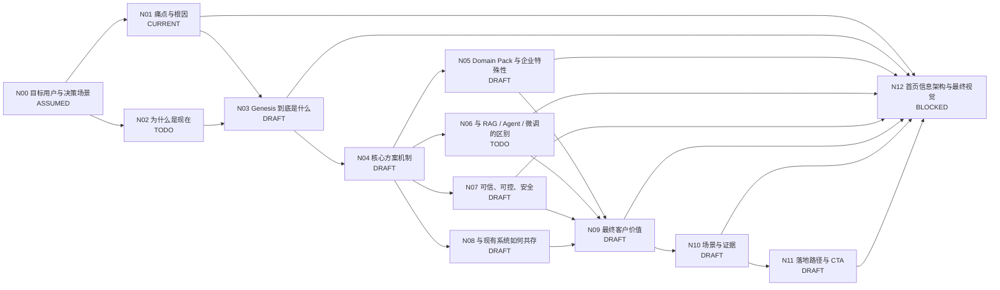

# Genesis 产品介绍 DAG

> 目标：把 Genesis 的官网产品介绍从“功能说明”整理为一个完整的客户认知闭环。后续按 DAG 节点逐个讨论、定稿，并在完成后同步到首页。

## 工作原则

- 一次只解决一个主节点，不同时发散多个主题。
- 每个节点必须形成“结论 + 用户会问什么 + 我们怎么回答 + 页面怎么表达 + 验收标准”。
- 节点未达到验收标准，不进入 `DONE`。
- 页面文案优先站在客户视角，不先讲平台术语。
- 技术术语仅用于解释“为什么可信 / 为什么不同 / 怎么落地”。
- 所有最终页面表达都要回到一个主线：**痛点 → Genesis 方案 → 达成的价值**。

## 状态定义

- `ASSUMED`：已有合理假设，但尚未专门确认。
- `DRAFT`：已有初步答案，仍需讨论和收敛。
- `CURRENT`：当前优先解决节点。
- `TODO`：尚未开始。
- `DONE`：结论、表达和验收标准均已满足。
- `BLOCKED`：依赖前置节点，暂不处理。

## DAG

## 节点清单

| 节点 | 关键问题 | 当前状态 | 页面落点 | 完成标准 |
|---|---|---|---|---|
| N00 目标用户与决策场景 | 首页首先说服谁？老板、业务负责人、IT/架构负责人各自最关心什么？ | ASSUMED | 全站语气、信息深度、CTA | 明确第一目标读者、第二目标读者，以及首页不服务谁 |
| N01 痛点与根因 | 为什么通用 AI 很强却仍不能真正替企业工作？缺的到底是什么？ | CURRENT | 首屏第一段 | 形成一句核心痛点、一条因果链、3–5 个必要缺失项；客户看完能立即认同 |
| N02 为什么是现在 | 为什么 Genesis 在当前阶段才变得必要？模型能力发生了什么变化？企业瓶颈发生了什么变化？ | TODO | 首屏或第二屏背景 | 能说明“模型已够强，企业化成为新瓶颈”，不写成行业空话 |
| N03 Genesis 到底是什么 | Genesis 属于什么产品类别？一句话怎么定义？它不是什么？ | DRAFT | 首屏第二段 / 产品定义 | 形成一句稳定产品定义 + 一句“不是什么”，能避免被误解成知识库/Agent/大模型 |
| N04 核心方案机制 | Genesis 到底给通用 AI 补了什么？怎么把企业业务世界提供给 AI？ | DRAFT | 首屏方案段 / 能力架构 | 形成清晰机制：业务、数据、规则、上下文、方法、事实、权限、边界如何成为 AI 可用能力 |
| N05 Domain Pack 与企业特殊性 | Domain Pack 是行业模板，还是“专业领域 × 企业特殊业务”的配置？如何解释可复用与个性化并存？ | DRAFT | 首屏方案段 / Domain Pack 区 | 明确定义 Domain Pack；回答“同一行业为什么不同公司配置不同” |
| N06 与 RAG / Agent / 微调的区别 | 为什么不是知识库、RAG、Agent 平台或 Fine-tuning？它们分别解决什么，Genesis 补哪一层？ | TODO | 差异化区 | 用客户能理解的对比说清边界；避免贬低其他技术；形成一句核心差异化 |
| N07 可信、可控、安全 | 为什么结果值得信？数据不足怎么办？权限、证据、边界、人审怎么处理？ | DRAFT | Trust / Evidence 区 | 回答“会不会胡说、乱做、越权”；形成可解释、可追溯、可控的原则 |
| N08 与现有系统如何共存 | ERP、CRM、数据库、数据平台、知识库、Agent、App 是否要替换？Genesis 放在哪里？ | DRAFT | 架构 / 集成区 | 一张图讲清“保留现有系统，Genesis 在中间增加业务理解与能力层” |
| N09 最终客户价值 | 企业专属 AI 最终带来什么，而不只是“懂业务”？ | DRAFT | 首屏第三段 / Value 区 | 价值从能力上升到业务结果：更可靠、更专业、能执行、可复用、降低风险/成本 |
| N10 场景与证据 | 在哪些真实工作里能证明上面的价值？有没有前后对比、POC、案例或指标？ | DRAFT | 场景区 / Proof 区 | 每个场景至少有“问题 → Genesis 如何介入 → 结果”；逐步补案例和数据证据 |
| N11 落地路径与 CTA | 客户怎么开始？是不是先做大规模数据治理/本体建设？第一步是什么？ | DRAFT | 结尾 CTA | 形成低门槛路径：从一个真实问题/闭环开始，再沉淀复用；CTA 明确具体 |
| N12 首页信息架构与最终视觉 | 上述答案如何排成一个低认知负担的官网？首图、区块顺序、视觉隐喻是什么？ | BLOCKED | `index.html` | 所有关键节点定稿后统一重构；页面能顺序回答客户最自然的问题 |

## 当前已形成的关键假设

这些内容来自当前讨论，先作为工作假设保留，后续在对应节点中正式定稿：

1. **主叙事不是技术流程，而是商业叙事：痛点 → Genesis 方案 → 达成的价值。**
2. 通用 AI 的问题不是“不聪明”，而是**缺少企业私有上下文和企业工作能力**。
3. 缺失信息至少包括：业务逻辑、业务规则、企业数据、实时事实、上下文、工作方式、方法、权限与边界。
4. Genesis 不重新造大模型，而是**把企业自己的业务世界和工作能力提供给通用 AI**。
5. Domain Pack 不是固定行业模板，而应被定义为：**专业领域能力 × 企业自己的业务、数据、规则和方法配置**。
6. 最终发生的是身份变化，而非简单增强：**通用 AI → 企业专属专业 AI**。
7. 一个重要候选表达：**模型不用变，变的是它看到和能够使用的业务世界。**
8. 一个重要候选定位：**Genesis 不让企业重新造一个 AI，而是让最好的通用 AI 学会你的公司。**
9. 可信原则候选：**有依据才判断；没有依据，就明确说不知道。**

## 当前优先节点：N01 痛点与根因

### 必须回答

1. 通用 AI 为什么不了解企业？
2. “不了解企业”具体会造成哪些业务后果？
3. 哪些缺失项是必要的，哪些只是补充项？
4. 用户是否会把问题误解为“模型不够强”或“只需要 RAG”？
5. 首屏怎样在 5–10 秒内让客户形成共识？

### 当前候选因果链

> 通用 AI 已经很强，但它没有企业自己的业务逻辑、数据、规则、上下文和工作方式，因此无法知道企业当前真正发生了什么、应该按什么规则判断、什么可以做、什么不能做。Genesis 的价值从这里开始。

### N01 验收标准

- 有一句 20 字左右的核心痛点，可作为首屏第一段标题。
- 有一段 60–100 字的根因解释，不依赖技术术语。
- 缺失项控制在 3–5 组，不堆词。
- 能自然引出 N03/N04，而不是直接跳到功能清单。
- 客户读完不会产生“这不就是模型能力不够”的误解。

## 更新记录

- 2026-09-03：创建 DAG。根据当前讨论将 N01 设为 `CURRENT`，其余节点按已有成熟度标记为 `ASSUMED / DRAFT / TODO / BLOCKED`。
